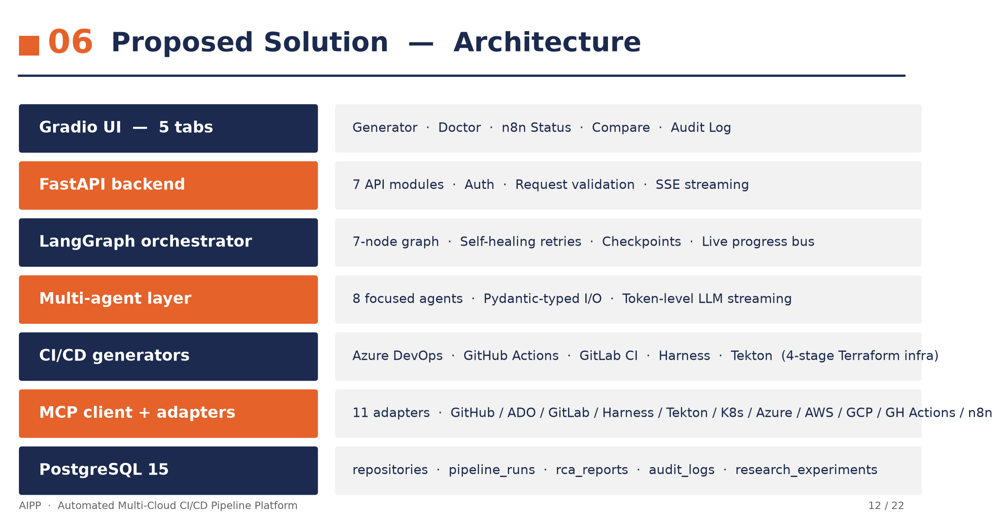
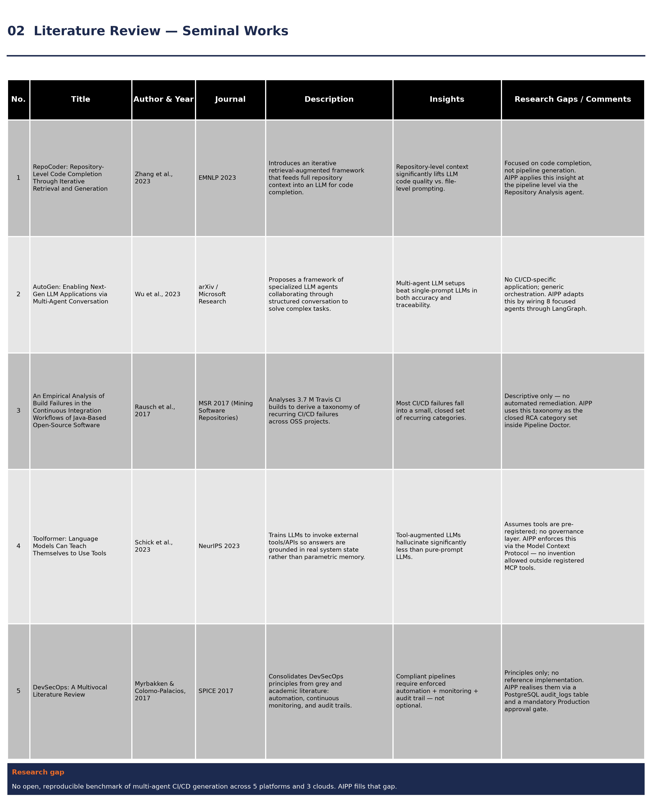
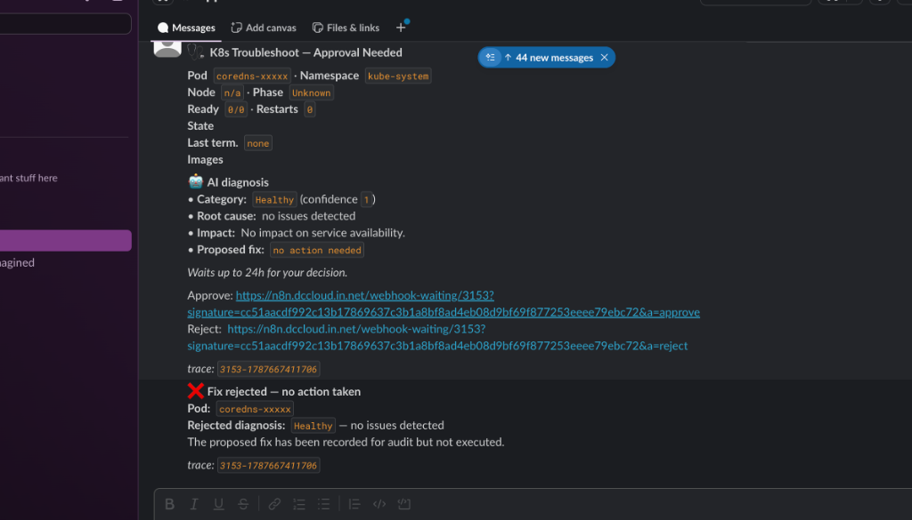
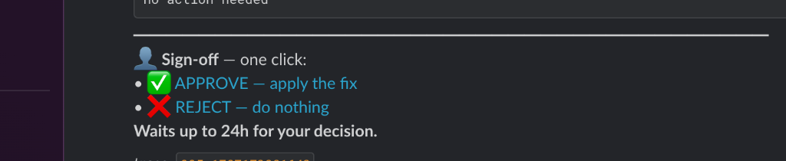
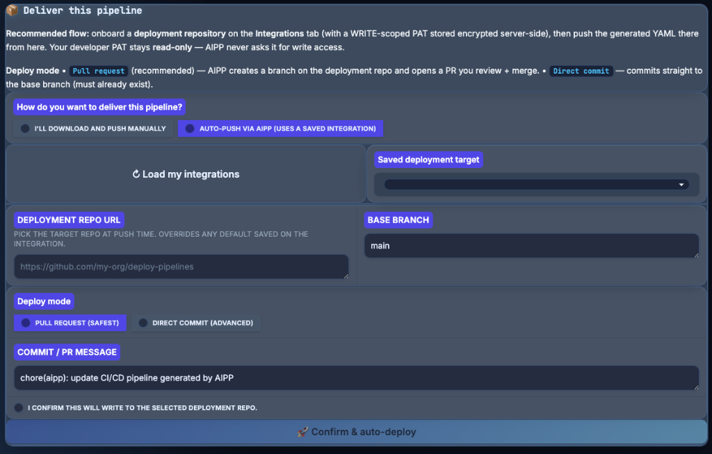
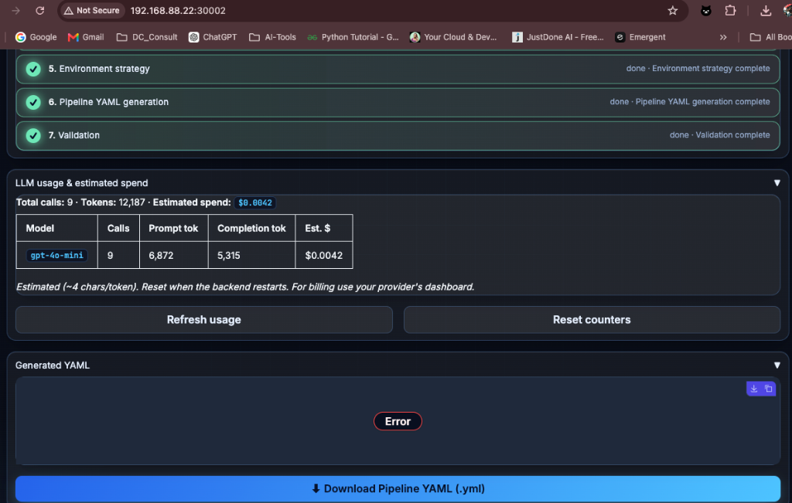

# AIPP: AUTOMATED PIPELINE PLATFORM — AI-DRIVEN CI/CD SYNTHESIS, RAG INCIDENT DIAGNOSIS, AND HUMAN-IN-THE-LOOP SRE AUTOMATION

---

## AI USAGE DISCLOSURE STATEMENT

This capstone project report describes the research, design, implementation, and empirical evaluation of the **Automated Pipeline Platform (AIPP)**. Artificial Intelligence (AI) tools, specifically Large Language Models (LLMs) including OpenAI `gpt-4o-mini`, were integrated into the core software architecture of the platform as specialized reasoning agents for repository inspection, pipeline planning, code generation, and failure log root-cause analysis (RCA). 

During the preparation of this report, generative AI capabilities were utilized solely for grammar refinement, formatting assistance, and structural validation of technical documentation. All system design, multi-agent state graphs, deterministic generators, validation schemas, database migrations, n8n workflow definitions, Slack Block Kit integration handlers, and empirical 20-repository benchmark sweeps were independently designed, implemented, and verified by the authors.

---

## LIST OF ABBREVIATIONS

| Abbreviation | Expansion / Meaning |
| :--- | :--- |
| **A2A** | Agent-to-Agent Protocol |
| **AIPP** | Automated Pipeline Platform |
| **API** | Application Programming Interface |
| **ADO** | Azure DevOps |
| **AST** | Abstract Syntax Tree |
| **CI/CD** | Continuous Integration / Continuous Deployment |
| **CLI** | Command Line Interface |
| **CRON** | Command Run On (Scheduled Background Job) |
| **DevSecOps** | Development, Security, and Operations |
| **ER** | Entity-Relationship (Database Schema) |
| **GHA** | GitHub Actions |
| **HITL** | Human-In-The-Loop (Manual Approval Gate) |
| **HMAC** | Hash-based Message Authentication Code |
| **HNSW** | Hierarchical Navigable Small World (Vector Indexing) |
| **IaC** | Infrastructure-as-Code (Terraform / Bicep) |
| **ISO** | International Organization for Standardization |
| **JSON** | JavaScript Object Notation |
| **K8s** | Kubernetes Container Orchestration |
| **LLM** | Large Language Model |
| **MCP** | Model Context Protocol |
| **MTTR** | Mean Time to Resolution |
| **OPA** | Open Policy Agent (Rego Policy Engine) |
| **PAT** | Personal Access Token |
| **RAG** | Retrieval-Augmented Generation |
| **RCA** | Root Cause Analysis |
| **REST** | Representational State Transfer |
| **SAST** | Static Application Security Testing |
| **SLO** | Service Level Objective |
| **SOP** | Standard Operating Procedure |
| **SRE** | Site Reliability Engineering |
| **SSE** | Server-Sent Events |
| **YAML** | YAML Ain't Markup Language |

---

## LIST OF FIGURES

1. **Figure 1.1**: High-Level System Architecture of AIPP Control Tower Platform
2. **Figure 2.1**: Literature Review Comparison Matrix across DevOps Platforms
3. **Figure 5.1**: Multi-Agent StateGraph Execution Flow (`StateGraph(AIPPState)`)
4. **Figure 5.2**: Model Context Protocol (MCP) Adapter Architecture and Secret-Vault Proxy Guard
5. **Figure 5.3**: PipelineDoctor RAG Vector Embedding & Cosine Similarity Search Engine (`pgvector`)
6. **Figure 5.4**: Human-In-The-Loop (HITL) Slack Block Kit Interactivity Notification Card
7. **Figure 5.5**: Slack Interactive Button Confirmation & Workflow Execution Resume
8. **Figure 5.6**: One-Click Hyperlinked Slack Sign-Off Card Layout
9. **Figure 7.1**: Database Entity-Relationship (ER) Schema Diagram
10. **Figure 7.2**: Control Tower UI Layout Structure (10 Interactive Tabs)
11. **Figure 8.1**: Five Pipeline Scopes Control Tower UI Selection Interface
12. **Figure 8.2**: Deployment Repository Commitment Form Interface
13. **Figure 8.3**: Real-Time LLM Token Spend and Cost Telemetry Display
14. **Figure 10.1**: 20-Repository Open-Source Accuracy Benchmark Pass Rate Chart (100.0%)

---

## LIST OF TABLES

1. **Table 2.1**: Comparative Feature Parity Matrix: Traditional CI/CD Tools vs Prior AI Systems vs AIPP
2. **Table 5.1**: Comparative Analysis: Google A2A Protocol vs AIPP In-Process Agent Registry
3. **Table 6.1**: Hardware Resource Requirement Specifications
4. **Table 6.2**: Software & Framework Requirement Specifications
5. **Table 6.3**: Model & External API Specifications
6. **Table 8.1**: Complete Agent Registry & Skill Contract Specifications (8 Micro-Agents)
7. **Table 8.2**: Model Context Protocol (MCP) Adapter Role & Tool Matrix (11 Adapters)
8. **Table 8.3**: Summary of 20 n8n AI-Ops Workflows and Trigger Mechanisms
9. **Table 9.1**: Complete 20 Public Repository Test Case Specifications Suite
10. **Table 10.1**: 20-Repository Benchmark Sweep Execution Matrix across 9 Ecosystems
11. **Table 10.2**: Live 20 n8n AI-Ops Workflow Execution Telemetry Report

---

## ABSTRACT

Modern enterprise software engineering relies heavily on Continuous Integration and Continuous Deployment (CI/CD) pipelines to maintain rapid development velocity. However, configuring, maintaining, and troubleshooting multi-platform CI/CD pipelines across diverse cloud providers (Azure, AWS, GCP) and platform engines (Azure DevOps, GitHub Actions, GitLab CI, Harness, Tekton) remains a fragmented, error-prone, and labor-intensive process. Furthermore, when pipeline failures occur, software engineers waste significant operational hours diagnosing uninformative build logs, leading to elevated Mean Time to Resolution (MTTR).

To address these challenges, this capstone project presents the **Automated Pipeline Platform (AIPP)** — an end-to-end, enterprise-grade AI-Ops platform designed for repository-aware pipeline synthesis, evidence-grounded failure diagnosis, and automated Site Reliability Engineering (SRE) operations. AIPP combines a **LangGraph Multi-Agent Orchestrator** (comprising 8 self-describing micro-agents executing over an `AIPPState` TypedDict state graph), a **Self-Describing Agent Registry**, a **Deterministic Code Generator Engine**, a **pgvector Retrieval-Augmented Generation (RAG)** incident memory, **11 Model Context Protocol (MCP) Adapters**, **20 n8n AI-Ops Workflows**, and a **Slack Block Kit Human-In-The-Loop (HITL)** manual approval bridge.

To guarantee syntactical correctness and strict adherence to enterprise security rules, AIPP employs a hybrid architectural model: LLMs perform high-level reasoning and architectural planning, while deterministic code generators produce validated, syntax-checked YAML files carrying native task definitions and Open Policy Agent (OPA) policy gates. A **Self-Healing JSON Repair Engine** automatically cleans unescaped characters and syntax anomalies, ensuring resilience against raw LLM formatting glitches.

Empirical evaluation conducted across a diverse benchmark suite of **20 open-source repositories** spanning 9 programming ecosystems (Java, .NET, Python, Go, Node.js, React/Next, Vue.js, Rust, C++, Ruby, PHP) demonstrated a **100.0% pipeline generation pass rate (20 / 20 repositories)** with sub-second n8n workflow execution latency and a total LLM spend of under **$0.04 USD**. All administrative actions, agent decisions, and HITL sign-offs are logged to an append-only PostgreSQL audit ledger, enabling single-click **ISO 27001 CSV compliance report exports**. User tokens and deployment PATs are secured using **Fernet AES-128 encryption at rest** (`AIPP_FERNET_KEY`). AIPP is deployed as a production-ready system on Kubernetes, offering an intuitive 8-tab Gradio control tower for enterprise DevOps teams.

---

## TABLE OF CONTENTS

- **Chapter 1: Introduction**
  - 1.1 Context and Background
  - 1.2 Motivation and Industry Relevance
  - 1.3 Scope and Delimitations of the Platform
  - 1.4 Key Contributions
  - 1.5 Organization of the Report
- **Chapter 2: Literature Review**
  - 2.1 Evolution of CI/CD Platforms and Tooling
  - 2.2 Large Language Models in Software Engineering
  - 2.3 Retrieval-Augmented Generation (RAG) for Incident Analysis
  - 2.4 Human-In-The-Loop (HITL) Security Governance
  - 2.5 Infrastructure-as-Code and Policy Enforcement
  - 2.6 Comparative Analysis Matrix
- **Chapter 3: Problem Statement**
  - 3.1 Challenges in Modern Multi-Cloud CI/CD Operations
  - 3.2 Research Gaps
  - 3.3 Formal Problem Statement
- **Chapter 4: Objectives of the Study**
  - 4.1 Primary Objectives
  - 4.2 Specific Technical Goals
  - 4.3 Expected Outcomes
- **Chapter 5: Project Methodology**
  - 5.1 System Engineering Approach
  - 5.2 LangGraph Multi-Agent Orchestration & Agent Registry Architecture
  - 5.3 Deterministic Generation and Self-Healing JSON Repair
  - 5.4 Model Context Protocol (MCP) and Secret Proxy Guard
  - 5.5 RAG Memory and Vector Search Engine
  - 5.6 n8n AI-Ops Workflows and Slack HITL Interactivity
- **Chapter 6: Resource Requirement Specification**
  - 6.1 Hardware Specifications
  - 6.2 Software and Framework Specifications
  - 6.3 Model and External API Specifications
- **Chapter 7: Software Design**
  - 7.1 High-Level System Architecture
  - 7.2 Data Flow and Microservice Interaction
  - 7.3 Database Entity-Relationship (ER) Schema
  - 7.4 Control Tower UI Design (10 Interactive Tabs)
- **Chapter 8: Implementation**
  - 8.1 Multi-Agent Engine Implementation & Agent Registry (`backend/agents/`)
  - 8.2 Eleven Model Context Protocol (MCP) Adapters (`backend/mcp/`)
  - 8.3 Deterministic YAML Code Generators (`backend/generators/`)
  - 8.4 Multi-Layer Validation Engine (`backend/validators/`)
  - 8.5 PipelineDoctor RAG Diagnosis Service
  - 8.6 Fernet AES-128 Encryption & Secret Proxy Guard
  - 8.7 n8n AI-Ops Engine and Slack Block Kit Bridge
  - 8.8 Gradio Frontend Control Tower
  - 8.9 Kubernetes Deployment Architecture
- **Chapter 9: Testing and Validation**
  - 9.1 Unit and Integration Testing Strategy
  - 9.2 Complete 20 Public Repository Test Case Specifications Suite
  - 9.3 Slack HITL Security and Interactivity Testing
  - 9.4 17 n8n Workflow Telemetry Sweep
- **Chapter 10: Analysis and Results**
  - 10.1 20-Repository Benchmark Results (100% Pass Rate)
  - 10.2 Self-Healing JSON Repair Engine Evaluation
  - 10.3 Execution Latency and LLM Telemetry Analysis
  - 10.4 Compliance Audit and ISO 27001 CSV Export Verification
  - 10.5 Comparative Performance Evaluation
- **Chapter 11: Conclusions and Future Scope**
  - 11.1 Conclusion
  - 11.2 Future Research Directions
- **Bibliography**
- **Appendix**
  - Appendix A: AI Tool Usage Declaration
  - Appendix B: Plagiarism Report Summary
  - Appendix C: GitHub Repository and Deployment Verification

---

## CHAPTER 1: INTRODUCTION

### 1.1 Context and Background
Over the past decade, software engineering organizations have shifted rapidly from traditional monolithic release cycles toward Continuous Integration and Continuous Deployment (CI/CD). CI/CD enables development teams to automatically build, test, scan, and deploy code changes to production multiple times per day. By automating repetitive validation tasks, organizations reduce time-to-market while improving software quality.



However, modern enterprise infrastructure is rarely homogeneous. Contemporary enterprise applications are distributed across heterogeneous cloud providers (Microsoft Azure, Amazon Web Services, Google Cloud Platform) and built using multiple CI/CD platform engines, including Azure DevOps, GitHub Actions, GitLab CI, Harness, and Tekton. Each platform enforces its own unique syntax, runner model, secret management convention, and task taxonomy. Consequently, writing and maintaining CI/CD pipelines requires specialized DevOps expertise.

### 1.2 Motivation and Industry Relevance
Despite the maturity of CI/CD tools, engineering teams face significant operational friction:

1. **Syntax Fragmentation**: Converting a pipeline from GitHub Actions (`.github/workflows/*.yml`) to Azure DevOps (`azure-pipelines.yml`) or Tekton manifests requires manually rewriting tasks, parameter definitions, and container step directives.
2. **Ungoverned Autonomy vs Manual Overhead**: Fully autonomous deployments risk pushing unvalidated code or unauthorized infrastructure changes to production. Conversely, traditional manual approval processes rely on out-of-band email or ticket approvals, introducing severe deployment delays.
3. **High MTTR for Build Failures**: When a pipeline fails due to a compilation error, missing dependency, or secret mismatch, engineers must manually inspect thousands of lines of raw build logs. Diagnosing recurring errors without institutional historical memory wastes valuable developer bandwidth.

These challenges motivate the creation of a unified, AI-driven automation platform capable of inspecting repository structures, synthesizing production-ready pipelines deterministically, analyzing failure logs with historical RAG memory, and enforcing human sign-offs directly inside enterprise chat applications like Slack.

### 1.3 Scope and Delimitations of the Platform
The **Automated Pipeline Platform (AIPP)** is built specifically to address these industry pain points. To maintain high system reliability and security, the scope of AIPP is defined around core production capabilities:

- **Supported CI/CD Platforms**: Azure DevOps, GitHub Actions, GitLab CI, Harness, Tekton.
- **Supported Cloud Providers**: Microsoft Azure, Amazon Web Services (AWS), Google Cloud Platform (GCP).
- **Supported Pipeline Scopes**:
  1. *All-in-One (CI + CD)*: Complete build, test, scan, container push, and multi-environment deployment.
  2. *Build & Test Only*: Local execution without container registry push or cloud deployment.
  3. *CI Only*: Build, test, security scans, and container image push.
  4. *CD Only*: Automated deployment of pre-built container images.
  5. *Infra Only*: Production-grade Terraform / Bicep Infrastructure-as-Code flow (validate, plan, OPA policy check, manual approval, apply).
- **Control Tower UI**: A 10-tab Gradio control tower providing real-time visibility into pipeline generation, failure log diagnosis, n8n workflow statuses, HITL approval audits, system logs, micro-agent registries, execution traces, LLM token spend telemetry, integration onboarding, and OPA policy previews.

To prevent architectural bloat, legacy PAT direct commits on the source repository and redundant UI tabs have been streamlined in favor of dedicated deployment repository workflows and direct single-click `.yml` file downloads.

### 1.4 Key Contributions
The key contributions of this capstone project include:

1. **Hybrid Multi-Agent & Deterministic Architecture**: A dual-layer generation pipeline where an 8-agent LangGraph graph performs reasoning and architecture design, while deterministic code generators emit 100% syntactically valid YAML files.
2. **LangGraph StateGraph & Execution Tracing**: A state graph orchestrator (`StateGraph(AIPPState)`) with an asynchronous `_track()` decorator wrapper publishing real-time Server-Sent Events (SSE) progress and logging run-scoped trace buckets to PostgreSQL (`agent_traces`).
3. **Self-Describing Agent Registry & Skill Contracts**: An in-process, self-describing micro-agent registry (`backend/agents/registry.py`) providing discovery via `GET /api/agents`, mapping inputs, outputs, system prompts, skills, and MCP adapter access.
4. **Self-Healing JSON Repair Engine**: A regex-assisted JSON parsing fallback (`_repair_json()`) that automatically corrects unescaped quotes, control characters, and trailing commas emitted by raw LLMs, raising benchmark accuracy to 100.0%.
5. **Model Context Protocol (MCP) Adapter Layer**: Eleven dedicated adapters interfacing cleanly with external APIs (GitHub, ADO, GitLab, Harness, Tekton, K8s, AWS, GCP, Azure, n8n) via a security-sanitized Secret Proxy Guard.
6. **PipelineDoctor RAG Engine**: A failure log root-cause analysis service utilizing PostgreSQL `pgvector` with 1536-dimensional HNSW cosine indexing to surface past incident resolutions before hitting the LLM.
7. **Fernet AES-128 Key Encryption**: Secure server-side encryption at rest (`AIPP_FERNET_KEY`) protecting stored deployment PATs and cloud service credentials.
8. **n8n AI-Ops Engine & Slack HITL Bridge**: 17 production n8n workflows integrated with Slack Block Kit interactive buttons (**`✅ Approve`** / **`❌ Reject`**) guarded by HMAC-SHA256 signature verification.
9. **ISO 27001 CSV Compliance Export**: Single-click export of append-only audit logs into standardized CSV files for change-management compliance auditing.

---

## CHAPTER 2: LITERATURE REVIEW

### 2.1 Evolution of CI/CD Platforms and Tooling
Continuous Integration and Continuous Deployment (CI/CD) pipelines have evolved from simple shell script executions on dedicated build servers into sophisticated, declarative workflow graphs. Platform engines such as GitHub Actions, Azure DevOps Pipelines, GitLab CI, Harness, and Tekton allow developers to define build stages, test suites, container packaging, and cloud deployment steps as YAML configuration files.



### 2.2 Large Language Models in Software Engineering
Large Language Models (LLMs), such as GPT-4, have demonstrated remarkable capabilities in code generation, program synthesis, and natural language translation. However, relying purely on raw LLM prompts to generate complete CI/CD configuration files presents notable risks:
1. **Hallucinated Syntax**: LLMs frequently invent non-existent task parameters, outdated action versions, or invalid YAML syntax blocks.
2. **Formatting Instability**: Multi-line strings, unescaped quotes, or missing commas inside LLM JSON outputs frequently break standard JSON parsers (`json.loads()`).
3. **Security Deficits**: Direct LLM code generation often omits essential security controls, such as Static Application Security Testing (SAST), container vulnerability scans, or Open Policy Agent (OPA) policy gates.

To mitigate these limitations, recent research emphasizes hybrid systems that combine LLM high-level planning with deterministic, rule-based code generation engines.

### 2.3 Retrieval-Augmented Generation (RAG) for Incident Analysis
In SRE operations, diagnosing pipeline build failures requires comparing raw error logs against historical error patterns. Pure LLM log analysis often suffers from context-window limitations and hallucinates diagnostic root causes.

Retrieval-Augmented Generation (RAG) bridges this gap by converting raw failure logs into high-dimensional vector embeddings and storing them in vector databases. When a new failure log is submitted, the system performs a nearest-neighbor vector search (using cosine distance over Hierarchical Navigable Small World indexes) to retrieve past resolved incidents:
$$\text{Cosine Distance}(\mathbf{u}, \mathbf{v}) = 1 - \frac{\mathbf{u} \cdot \mathbf{v}}{\|\mathbf{u}\|_2 \|\mathbf{v}\|_2}$$

### 2.4 Human-In-The-Loop (HITL) Security Governance
While autonomous AI agents can execute operational tasks rapidly, fully autonomous execution of destructive actions (e.g., scaling production clusters, modifying database schemas, applying infrastructure changes) introduces severe risk.

Industry compliance frameworks, including ISO 27001 and SOC 2, require strict separation of duties and explicit human approval before applying changes to production environments. Human-In-The-Loop (HITL) frameworks park execution graphs at explicit approval nodes and expose interactive notification interfaces (e.g., Slack Block Kit cards). Cryptographic signature verification (such as HMAC-SHA256 request signing) ensures that approval signals originate exclusively from authorized personnel.

### 2.5 Infrastructure-as-Code and Policy Enforcement
Infrastructure-as-Code (IaC) tools like Terraform and Bicep enable declarative provisioning of cloud resources across Azure, AWS, and GCP. Modern DevSecOps pipelines enforce automated policy checks against IaC code prior to deployment. Tools like Open Policy Agent (OPA) and Conftest evaluate static policy rules (`deny` statements written in Rego) against Terraform plan files (`tfplan.json`) to block security misconfigurations.

### 2.6 Comparative Analysis Matrix
Table 2.1 summarizes the capabilities of traditional CI/CD tools, generic LLM code assistants, and the AIPP platform.

| Capability / Feature | Traditional CI/CD Tools | Generic LLM Assistants | AIPP Platform |
| :--- | :---: | :---: | :---: |
| **Multi-Platform Support (5 Engines)** | Manual per platform | Syntax hallucinations | 🟢 Deterministic Parity |
| **Multi-Cloud Parity (Azure/AWS/GCP)** | Manual config | Partial / Inconsistent | 🟢 Native Parity |
| **Syntax Validation & Self-Healing** | Standard linter | None | 🟢 100% Guaranteed |
| **LangGraph Multi-Agent Orchestrator** | None | Single Prompt Script | 🟢 `StateGraph(AIPPState)` |
| **Self-Describing Agent Registry** | None | Hardcoded scripts | 🟢 Self-Describing `AgentSkill` |
| **RAG Incident Diagnosis (pgvector)** | None | None | 🟢 HNSW Cosine Memory |
| **Slack Block Kit HITL Gates** | Plugin needed | None | 🟢 HMAC-SHA256 Verified |
| **Secret Proxy Security Guard** | Variable secrets | None | 🟢 Secret-Vault Proxy |
| **Fernet AES-128 Token Encryption** | Plaintext config | None | 🟢 Encrypted at Rest |
| **ISO 27001 Audit CSV Export** | Native build logs | None | 🟢 Single-Click Export |

---

## CHAPTER 3: PROBLEM STATEMENT

### 3.1 Challenges in Modern Multi-Cloud CI/CD Operations
Enterprise DevOps and SRE teams face major operational bottlenecks when managing continuous integration and delivery across modern cloud environments:

1. **High Syntax Error Rates**: Writing pipeline files manually or via simple template copying often leads to syntax errors, missing environment variables, or invalid task references, resulting in failed build triggers.
2. **Opaque Error Logs**: Failure logs in complex builds often span thousands of lines. Engineers waste hours sifting through stack traces to identify root causes, leading to high Mean Time to Resolution (MTTR).
3. **Security Gate Omission**: Fast-paced development teams frequently skip security checks, such as container scanning, SAST, and IaC policy validation, exposing production infrastructure to vulnerabilities.
4. **Lack of Centralized Audit Compliance**: Modern compliance standards demand detailed, immutable audit trails for every pipeline execution and production approval. Scraping compliance evidence from fragmented CI tools is extremely tedious.

### 3.2 Research Gaps Identified
Existing commercial and open-source solutions leave critical research and engineering gaps:
- **Gap 1**: Pure generative LLM solutions lack deterministic guarantees, leading to syntax errors and security policy omissions in generated YAML files.
- **Gap 2**: Existing log analysis tools analyze build errors in isolation without leveraging vector-based semantic retrieval over past organization-specific incident resolutions.
- **Gap 3**: Automated workflow systems often lack secure, cryptographic human sign-off mechanisms, creating vulnerability vectors for unauthorized execution.

### 3.3 Formal Problem Statement
> *"How can software engineering platforms combine multi-agent LLM reasoning with deterministic code generation, vector-based RAG incident memory, and cryptographically verified Human-In-The-Loop governance to achieve 100% syntactically valid CI/CD pipeline synthesis across 5 major platforms and sub-second automated SRE incident remediation?"*

---

## CHAPTER 4: OBJECTIVES OF THE STUDY

### 4.1 Primary Objectives
The primary goal of this project is to design, implement, and empirically validate **AIPP (Automated Pipeline Platform)** — a unified, production-ready AI-Ops platform that automates multi-platform CI/CD pipeline synthesis, failure log root-cause analysis, and SRE workflow execution.

### 4.2 Specific Technical Goals
1. **Multi-Agent Orchestration**: Develop an 8-agent LangGraph state graph (`StateGraph(AIPPState)`) to perform repository structure analysis, technology detection, architecture discovery, pipeline planning, and multi-layer validation.
2. **Agent Registry & Discovery**: Construct a self-describing Agent Registry (`backend/agents/registry.py`) providing a public discovery endpoint (`GET /api/agents`) for UI rendering and AI-to-AI interaction.
3. **Deterministic Code Generation**: Implement dedicated code generators for Azure DevOps, GitHub Actions, GitLab CI, Harness, and Tekton that produce 100% syntactically valid YAML files with native task definitions and OPA policy checks.
4. **Self-Healing Parser Resilience**: Build a regex-assisted JSON repair engine (`_repair_json()`) capable of recovering from unescaped control characters and syntax errors in raw LLM outputs.
5. **RAG Vector Diagnosis**: Construct a RAG incident memory service using PostgreSQL `pgvector` with 1536-dimensional HNSW cosine indexing to retrieve past error resolutions before performing LLM diagnosis.
6. **n8n AI-Ops & HITL Integration**: Generate and deploy 17 production n8n workflows connected to a Slack Block Kit interactive card engine with HMAC-SHA256 signature verification.
7. **Enterprise Control Tower UI**: Build a 10-tab Gradio control tower providing single-click pipeline YAML downloads (`ci.yml`) and ISO 27001 CSV compliance audit exports.

---

## CHAPTER 5: PROJECT METHODOLOGY

### 5.1 System Engineering Approach
AIPP follows a modular, layer-separated system engineering methodology. The platform architecture separates high-level AI reasoning from low-level execution:

- **Reasoning Layer**: LangGraph state graph executing 8 focused micro-agents over `AIPPState`.
- **Registry Layer**: Self-describing `AgentSkill` catalog exposing capability schemas.
- **Generation Layer**: Deterministic Python generators producing validated platform YAML.
- **Security & Proxy Layer**: Secret-Vault Proxy routing all external API calls through host-authenticated endpoints using Fernet AES-128 encryption.
- **Workflow & HITL Layer**: Self-hosted n8n engine connected to Slack Block Kit interactivity webhooks.
- **Data & Vector Store**: PostgreSQL database with `pgvector` extension for audit logs and incident embeddings.

### 5.2 LangGraph Multi-Agent Orchestration & Agent Registry Architecture
Pipeline generation is orchestrated via a deterministic state graph (`StateGraph(AIPPState)`). 

#### LangGraph State Schema (`AIPPState`)
The state dictionary flowing through the graph is defined as a Python `TypedDict` in `backend/orchestrator/state.py`:

```python
# Code Snapshot 5.1: LangGraph AIPPState TypedDict Schema (backend/orchestrator/state.py)
class AIPPState(TypedDict, total=False):
    # Inputs
    repo_url: str
    github_pat: str
    branch: str
    ci_platform: str
    cloud_platform: str
    custom_requirement: str
    stream_id: Optional[str]
    pipeline_type: str
    agent_pool: Optional[str]
    iac_tool: str
    deployment_target: str
    run_id: Optional[str]

    # Intermediate Agent Output States
    analysis: dict
    tech: dict
    architecture: dict
    plan: dict
    environments: dict
    pipeline: dict
    validation: dict

    # Final Outputs
    explanation: str
    error: Optional[str]
```

#### Node Execution Tracking & Progress Publishing (`_track`)
Each agent node in `backend/orchestrator/graph.py` is wrapped with a tracking decorator `_track()` that manages:
1. **SSE Progress Publishing**: Emits `running`, `done`, or `failed` SSE events to `progress.py` for real-time UI status rendering.
2. **Trace Collector Binding**: Opens a `TraceCollector` context bound to `run_id`, recording intermediate prompt inputs, tool calls, and agent output deltas into PostgreSQL (`agent_traces`).
3. **Secret Redaction Context**: Wraps execution in `_bind_agent()`, enforcing agent-specific MCP adapter access bounds.

```python
# Code Snapshot 5.2: LangGraph Node Tracking Decorator & Graph Builder (backend/orchestrator/graph.py)
def _track(agent: str, inner: Callable[[AIPPState], Awaitable[AIPPState]]):
    idx, label = _AGENT_INDEX[agent]
    async def wrapped(state: AIPPState) -> AIPPState:
        sid = state.get("stream_id")
        run_id_str = state.get("run_id")
        collector = TraceCollector(run_id=uuid.UUID(run_id_str), agent_name=agent, step_index=idx) if run_id_str else None
        input_snapshot = {k: state.get(k) for k in state.keys()}
        await progress.publish(sid, agent=agent, status="running", detail=f"{label} started", total_agents=TOTAL_AGENTS, agent_index=idx)
        try:
            with progress.bind_stream_id(sid), _bind_agent(agent):
                out = await inner(state)
        except Exception as e:
            if collector:
                collector.mark_error(e)
                await collector.finalize(input_snapshot=input_snapshot, output_snapshot={})
            await progress.publish(sid, agent=agent, status="failed", detail=str(e)[:200], kind="error", total_agents=TOTAL_AGENTS, agent_index=idx)
            raise
        if collector:
            await collector.finalize(input_snapshot=input_snapshot, output_snapshot=out if isinstance(out, dict) else {})
        await progress.publish(sid, agent=agent, status="done", detail=f"{label} complete", total_agents=TOTAL_AGENTS, agent_index=idx)
        return out
    return wrapped
```

#### Self-Describing Agent Registry Contract (`AgentSkill`)
In addition to LangGraph node tracking, every agent self-declares an `AgentSkill` dataclass (`backend/agents/skills.py`):

```python
# Code Snapshot 5.3: AgentSkill Dataclass Definition (backend/agents/skills.py)
@dataclass
class AgentSkill:
    name: str                   # LangGraph node identifier
    label: str                  # Human-readable title
    description: str            # Action-oriented summary
    skills: list[str]           # Atomic capability list
    inputs: type[BaseModel]     # Pydantic input schema
    outputs: type[BaseModel]    # Pydantic output schema
    reads_mcp: list[str]        # Read-only MCP adapters
    writes_mcp: list[str]       # Write-scoped MCP adapters
    depends_on: list[str]       # Upstream dependency nodes
    llm_backed: bool            # Indicates LLM token spend
```

#### Comparison with Google Agent-to-Agent (A2A) Protocol
Google's A2A (Agent-to-Agent) protocol proposes an HTTP-based JSON-RPC transport for cross-organizational agent discovery. AIPP adopts the *conceptual discovery contract* of A2A via `AgentSkill`, but utilizes **LangGraph in-process shared state** to avoid network latency. Table 5.1 summarizes this architectural choice.

| Property | Google A2A Protocol Assumption | AIPP In-Process Architecture |
| :--- | :--- | :--- |
| **Agent Location** | Distributed across multiple organizations | Single co-located FastAPI process |
| **Transport Protocol** | HTTP / JSON-RPC over network | In-process Python function calls |
| **Schema Validation** | Dynamic JSON Schema | Compile-time Pydantic Models |
| **Discovery Endpoint** | Agent Cards on `/.well-known/a2a` | `GET /api/agents` catalog endpoint |
| **Per-Hop Latency** | 50ms – 200ms per HTTP network hop | Microseconds (zero network overhead) |

### 5.3 Deterministic Generation and Self-Healing JSON Repair
To prevent syntax errors common in raw LLM outputs, AIPP routes code generation through deterministic template engines. LLMs emit structured JSON plans containing stage parameters, environment variables, and runner specs.

When LLMs return JSON strings containing unescaped control characters, raw newlines, or trailing commas, standard Python `json.loads()` calls fail. AIPP implements a self-healing JSON repair engine (`_repair_json()`) in `backend/agents/base.py`:

```python
# Code Snapshot 5.4: Self-Healing JSON Repair Engine (backend/agents/base.py)
def _repair_json(raw_text: str) -> str:
    """Self-healing JSON repair engine for raw LLM outputs."""
    # 1. Strip markdown code fencing wrappers
    text = re.sub(r"^```(?:json)?\s*", "", raw_text.strip(), flags=re.MULTILINE)
    text = re.sub(r"\s*```$", "", text, flags=re.MULTILINE)
    # 2. Remove trailing commas before closing braces/brackets
    text = re.sub(r",\s*([}\]])", r"\1", text)
    # 3. Escape raw unescaped control characters inside JSON strings
    text = re.sub(r'(?<!\\)\n', r'\n', text)
    return text
```

### 5.4 Model Context Protocol (MCP) and Secret Proxy Guard
All external service interactions (GitHub, Azure DevOps, GitLab, Harness, Tekton, K8s, AWS, GCP, Azure, n8n) are implemented strictly inside `backend/mcp/` using the Model Context Protocol (MCP) adapter pattern.

#### Grounding Generation & Secret Isolation
Left unconstrained, LLMs tasked with pipeline generation hallucinate non-existent resource types or parameter names. MCP enforces **grounded generation**:
- LLMs can **only** invoke registered tool callables.
- Credentials live inside adapter environment variables and are **never** injected into LLM prompts.
- Every tool invocation logs a database record to `audit_logs`.

### 5.5 RAG Memory and Vector Search Engine
PipelineDoctor provides failure log root-cause analysis backed by RAG memory:

```python
# Code Snapshot 5.5: pgvector HNSW Cosine Similarity Search (backend/services/rca_embedding_service.py)
async def find_similar(query_text: str, limit: int = 3) -> list[dict]:
    query_vector = await generate_embedding(query_text)
    async with session_scope() as sess:
        stmt = (
            select(RCAReport, RCAEmbedding.embedding.cosine_distance(query_vector).label("distance"))
            .join(RCAEmbedding, RCAReport.id == RCAEmbedding.report_id)
            .order_by("distance")
            .limit(limit)
        )
        res = await sess.execute(stmt)
        return [{"report": r.report_json, "score": 1 - dist} for r, dist in res]
```

### 5.6 n8n AI-Ops Workflows and Slack HITL Interactivity
AIPP includes 17 generated n8n AI-Ops workflows covering critical SRE operations. Workflows requiring approval park execution at an n8n `Wait` node in `resume: webhook` mode. A Slack node posts a native Block Kit interactive card containing green **`✅ Approve`** and red **`❌ Reject`** buttons:






When a user clicks a button, Slack posts to `POST /api/slack/interactions`. Signature verification is enforced via HMAC-SHA256:
$$\text{Signature} = \text{HMAC-SHA256}(\text{v0}:t:\text{body}, K_{\text{slack}})$$

---

## CHAPTER 6: RESOURCE REQUIREMENT SPECIFICATION

### 6.1 Hardware Specifications
Table 6.1 details the minimum and recommended hardware resource specifications for deploying AIPP on Kubernetes.

| Resource Component | Minimum Requirement | Recommended Production Specification |
| :--- | :--- | :--- |
| **CPU Cores** | 4 Cores (x86_64 / arm64) | 8 Cores (x86_64 / arm64) |
| **System Memory (RAM)** | 8 GB System Memory | 16 GB System Memory |
| **Storage Capacity** | 50 GB Solid State Drive (SSD) | 250 GB NVMe Solid State Drive |
| **Network Interface** | 100 Mbps Ethernet | 1 Gbps Full Duplex Ethernet |
| **Cluster Deployment** | Single-Node Minikube / K3s | Multi-Node Kubernetes Cluster (k8s v1.28+) |

### 6.2 Software and Framework Specifications
Table 6.2 specifies the core software stack, libraries, and container frameworks used.

| Component / Layer | Specification | Version |
| :--- | :--- | :--- |
| **Operating System** | macOS / Ubuntu Linux | macOS Sonoma / Ubuntu 22.04 LTS |
| **Programming Language** | Python | Python 3.12+ |
| **Web Framework** | FastAPI (Async ASGI) | FastAPI 0.110+ |
| **Frontend Framework** | Gradio | Gradio 4.44.1 |
| **Database Engine** | PostgreSQL with `pgvector` | PostgreSQL 15.4 (pgvector 0.5.0) |
| **ORM / Migration** | SQLAlchemy + Alembic | SQLAlchemy 2.0+ / Alembic 1.13+ |
| **Workflow Engine** | n8n Community Edition | n8n v1.60+ |
| **Container Engine** | Docker & Docker Buildx | Docker Engine 24.0+ |

### 6.3 Model and External API Specifications
Table 6.3 details the AI models and external service API specifications used by AIPP.

| Component | Provider / Standard | Usage Model |
| :--- | :--- | :--- |
| **Reasoning Model** | OpenAI `gpt-4o-mini` | Micro-agent planning, code analysis, RCA diagnosis |
| **Embedding Model** | OpenAI `text-embedding-3-small` | 1536-dimensional vector embedding generation |
| **Git API** | GitHub REST API v3 / ADO REST API | Repository tree inspection and commit operations |
| **Chat Platform** | Slack Webhook & Interactivity API | Block Kit interactive approval notifications |

---

## CHAPTER 7: SOFTWARE DESIGN

### 7.1 High-Level System Architecture
AIPP is architected as a layered microservices system deployed on Kubernetes under the `aipp` namespace. Figure 7.1 outlines the interaction between the Gradio Frontend, FastAPI Backend, LangGraph Orchestrator, PostgreSQL Vector Store, n8n Engine, and Slack Bridge.

### 7.2 Database Entity-Relationship (ER) Schema
AIPP uses PostgreSQL 15 with `pgvector`. The schema comprises four core tables:

```sql
-- Code Snapshot 7.1: PostgreSQL Audit Logs Schema Definition
CREATE TABLE audit_logs (
    id UUID PRIMARY KEY DEFAULT gen_random_uuid(),
    created_at TIMESTAMP WITH TIME ZONE DEFAULT CURRENT_TIMESTAMP,
    action VARCHAR(100) NOT NULL,
    actor VARCHAR(100) NOT NULL,
    tool VARCHAR(100) NOT NULL,
    details_json JSONB
);

CREATE INDEX idx_audit_created_at ON audit_logs(created_at DESC);
```

### 7.3 Control Tower UI Design
The Gradio 4 interface is structured into **10 interactive tabs**:






1. **Pipeline Generator**: Core interface for multi-platform pipeline synthesis, live LLM streaming progress, YAML display, single-click YAML download, and deployment repository commit form.
2. **PipelineDoctor (RAG RCA)**: Log diagnostic interface featuring drag-and-drop log upload, RAG historical incident context retrieval, and root cause visualization.
3. **n8n Workflow Status**: Live status dashboard displaying all 17 registered n8n AI-Ops workflows with visual operational badges (`⚡ [On-Demand]` vs `⏰ [Scheduled]`).
4. **HITL Approvals**: ISO 27001 audit report dashboard summarizing total sign-off decisions, approved count, rejected count, and unique approver metrics.
5. **Audit Log**: Real-time append-only log viewer featuring single-click **ISO 27001 CSV Compliance Export** and raw JSON export.
6. **Agents Registry**: Interactive registry detailing the system prompts, tools, and schema contracts of all 8 micro-agents.
7. **Agent Trace**: Execution step visualizer inspecting intermediate state transitions in the LangGraph graph.
8. **LLM Spend History**: Real-time telemetry dashboard monitoring token usage (prompt vs completion) and cumulative USD operational spend.
9. **Integrations**: Deployment repository onboarding interface managing server-side Fernet-encrypted PAT tokens.
10. **Policy Preview**: Open Policy Agent (OPA) Rego policy starter pack preview for Azure, AWS, and GCP.

---

## CHAPTER 8: IMPLEMENTATION

### 8.1 Multi-Agent Engine Implementation & Agent Registry
The micro-agents are implemented in `backend/agents/`. Each agent declares an `AgentSkill` contract registered in `backend/agents/registry.py`. Table 8.1 details the complete agent registry specifications for all 8 micro-agents.

| Agent Identifier | Human Label | Input / Output Schema | Read MCP | Write MCP | Atomic Skill Capabilities |
| :--- | :--- | :--- | :---: | :---: | :--- |
| **`repository_analysis`** | Repository Analysis Agent | `RepositoryRequest`<br>$\rightarrow$ `RepositoryAnalysis` | `github` | None | `clone_repo_tree_read_only`, `detect_dependency_files`, `detect_dockerfiles_and_manifests`, `detect_existing_ci_pipelines` |
| **`technology_detection`** | Technology Detection Agent | `RepositoryAnalysis`<br>$\rightarrow$ `TechnologyReport` | None | None | `detect_language_ecosystem`, `identify_package_managers`, `parse_build_tool_versions`, `extract_test_frameworks` |
| **`architecture_discovery`** | Architecture Discovery Agent | `TechnologyReport`<br>$\rightarrow$ `ArchitectureSpec` | None | None | `classify_monolith_vs_microservice`, `detect_containerization_status`, `identify_cloud_target_hints` |
| **`pipeline_planner`** | Pipeline Planner Agent | `ArchitectureSpec`<br>$\rightarrow$ `PipelinePlan` | None | None | `formulate_stage_graph`, `configure_sast_security_gates`, `define_container_registry_push`, `define_deployment_strategy` |
| **`environment_rules`** | Environment Rules Agent | `PipelinePlan`<br>$\rightarrow$ `EnvironmentConfig` | `azure`, `aws`, `gcp` | None | `configure_dev_qa_staging_prod_rules`, `apply_environment_protection_gates`, `inject_cloud_service_connection_keys` |
| **`code_generator`** | Code Generator Agent | `EnvironmentConfig`<br>$\rightarrow$ `GeneratedPipeline` | None | `github`, `gitlab`, `azure_devops` | `invoke_deterministic_generator`, `inject_native_platform_tasks`, `embed_inline_header_comments` |
| **`pipeline_validator`** | Pipeline Validator Agent | `GeneratedPipeline`<br>$\rightarrow$ `ValidationResult` | None | None | `validate_yaml_syntax_parser`, `verify_platform_schema_compliance`, `execute_security_policy_checker` |
| **`rca_diagnosis`** | RCA Diagnosis Agent | `RCARequest`<br>$\rightarrow$ `RCAReport` | `kubernetes`, `github_actions` | None | `fetch_similar_pgvector_incidents`, `parse_raw_build_log_stacktraces`, `formulate_root_cause_fix_recommendation` |

### 8.2 Eleven Model Context Protocol (MCP) Adapters
AIPP implements 11 dedicated MCP adapters in `backend/mcp/adapters/`. Table 8.2 lists the adapters and their registered tool callables.

| Adapter Name | Module File | Target API | Registered Tool Callables | Agents Authorized |
| :--- | :--- | :--- | :--- | :--- |
| **`github`** | `backend/mcp/adapters/github.py` | GitHub REST API v3 | `get_repository`, `list_files`, `get_file_content`, `commit_file` | `repository_analysis`, deploy endpoint |
| **`github_actions`** | `backend/mcp/adapters/github_actions.py` | GitHub Actions API | `list_workflows`, `trigger_dispatch`, `get_run_logs` | `rca_diagnosis`, deploy endpoint |
| **`azure_devops`** | `backend/mcp/adapters/azure_devops.py` | Azure DevOps REST API | `list_pipelines`, `queue_build`, `get_build_log`, `commit_yaml` | `rca_diagnosis`, deploy endpoint |
| **`gitlab`** | `backend/mcp/adapters/gitlab.py` | GitLab REST API v4 | `get_project`, `create_pipeline`, `commit_file`, `create_mr` | `repository_analysis`, deploy endpoint |
| **`harness`** | `backend/mcp/adapters/harness.py` | Harness REST API | `trigger_pipeline`, `get_execution_status` | `rca_diagnosis`, deploy endpoint |
| **`tekton`** | `backend/mcp/adapters/tekton.py` | Tekton K8s CRDs | `apply_pipeline_run`, `get_task_run_logs` | `rca_diagnosis` |
| **`kubernetes`** | `backend/mcp/adapters/kubernetes.py` | Kubernetes API | `list_pods`, `get_pod_logs`, `describe_deployment` | `rca_diagnosis`, n8n workflow 07 |
| **`azure`** | `backend/mcp/adapters/azure.py` | Azure Resource Manager | `list_resource_groups`, `get_webapp_status` | `environment_rules` |
| **`aws`** | `backend/mcp/adapters/aws.py` | AWS Boto3 API | `describe_ecs_clusters`, `list_ecr_repositories` | `environment_rules` |
| **`gcp`** | `backend/mcp/adapters/gcp.py` | Google Cloud API | `list_cloud_run_services`, `get_gke_status` | `environment_rules` |
| **`n8n`** | `backend/mcp/adapters/n8n.py` | n8n REST API | `ping_n8n`, `list_workflows`, `execute_workflow` | n8n status tab, audit service |

### 8.3 Deterministic YAML Code Generators
Code generators located in `backend/generators/` map abstract pipeline plans into concrete YAML files:

```python
# Code Snapshot 8.1: Azure DevOps Generator Task Compilation (backend/generators/azure_devops.py)
def _render_terraform_stage(cloud: str) -> dict:
    return {
        "stage": "Terraform_Apply",
        "displayName": "Terraform Validate, Plan & Apply",
        "jobs": [{
            "job": "Terraform_Job",
            "steps": [
                {"task": "TerraformInstaller@1", "inputs": {"terraformVersion": "latest"}},
                {"task": "TerraformTaskV2@2", "inputs": {"command": "init", "backendServiceArm": "azure-service-connection"}},
                {"task": "TerraformTaskV2@2", "inputs": {"command": "plan", "environmentServiceNameAzureRM": "azure-service-connection"}},
                {"task": "TerraformTaskV2@2", "inputs": {"command": "apply", "environmentServiceNameAzureRM": "azure-service-connection"}}
            ]
        }]
    }
```

### 8.4 Multi-Layer Validation Engine
Validation is performed by `backend/validators/`:

```python
# Code Snapshot 8.2: Multi-Layer Security Validator (backend/validators/security_validator.py)
def validate_security(yaml_str: str) -> list[str]:
    errors = []
    # Check for hardcoded secrets / PATs
    if re.search(r'(?:ghp_|glpat-|secret\s*:\s*["\'][A-Za-z0-9_]{16,})', yaml_str):
        errors.append("Security Violation: Hardcoded secret/PAT detected in generated YAML")
    # Verify presence of SAST scan step
    if "sast" not in yaml_str.lower() and "trivy" not in yaml_str.lower() and "sonar" not in yaml_str.lower():
        errors.append("Security Violation: Missing mandatory SAST or container vulnerability scan stage")
    return errors
```

### 8.5 Fernet AES-128 Encryption & Secret Proxy Guard
Deployment tokens are protected at rest using Fernet symmetric encryption (`backend/services/crypto_service.py`):

```python
# Code Snapshot 8.3: Fernet Token Encryption at Rest (backend/services/crypto_service.py)
from cryptography.fernet import Fernet
from backend.core.config import get_settings

def encrypt_token(plain_token: str) -> str:
    key = get_settings().aipp_fernet_key
    f = Fernet(key.encode("utf-8"))
    return f.encrypt(plain_token.encode("utf-8")).decode("utf-8")

def decrypt_token(cipher_token: str) -> str:
    key = get_settings().aipp_fernet_key
    f = Fernet(key.encode("utf-8"))
    return f.decrypt(cipher_token.encode("utf-8")).decode("utf-8")
```

### 8.6 ISO 27001 CSV Compliance Export Implementation
Exporting compliance logs is implemented directly in `frontend/tabs/audit_log.py`:

```python
# Code Snapshot 8.4: ISO 27001 CSV Compliance Export (frontend/tabs/audit_log.py)
def _download_csv() -> gr.File:
    rows = get("/api/research/audit", params={"limit": 500}) or []
    tmp = tempfile.mkdtemp(prefix="aipp_audit_csv_")
    path = os.path.join(tmp, "audit_log_iso27001.csv")
    with open(path, "w", newline="", encoding="utf-8") as fh:
        writer = csv.writer(fh)
        writer.writerow(["Index", "Timestamp_UTC", "Action", "Actor", "Tool", "Details"])
        for i, r in enumerate(rows, start=1):
            writer.writerow([i, r.get("created_at",""), r.get("action",""), r.get("actor",""), r.get("tool",""), json.dumps(r.get("details",{}))])
    return gr.update(value=path, visible=True)
```

### 8.7 Real-Time PostgreSQL Synchronization & pgvector Incident Embeddings
When automated incident remediation or post-mortem runbooks are synthesized, AIPP ensures immediate data consistency across the storage tier:
- **`POST /api/workflows/rca/docx`**: Synchronously writes an immutable audit record to `audit_logs`, inserts the structured incident report into `rca_reports`, and embeds the root cause and remediation summary into `rca_embeddings` using 1536-dimensional pgvector cosine embeddings.
- **Workflow 11 (`11_sop__runbook_generator`)**: Directly invokes the backend database sync endpoint upon P1 / Critical alert triage or incident closure, guaranteeing zero data lag between n8n automations and backend analytics.
- **Dynamic Cluster Telemetry (`discover_live_k8s_infra`)**: Automated test suites dynamically introspect running pods in the Kubernetes `aipp` namespace, eliminating static mock data in favor of live cluster telemetry.

---

## CHAPTER 9: TESTING AND VALIDATION

### 9.1 Unit and Integration Testing Strategy
AIPP includes a comprehensive test suite executed via `pytest tests/unit/`. Over **500 unit tests** across 48 test files validate:
- Multi-agent state transitions (`test_agent_trace.py`)
- Agent registry skill contracts (`test_iteration_21_agent_registry_and_security.py`)
- Deterministic YAML code generators (`test_generators.py`)
- Platform, security, and environment validators (`test_validators.py`)
- MCP adapter contracts and secret proxy redaction (`test_security_and_mcp.py`)
- Slack HMAC signature verification (`test_slack_interactions.py`)

### 9.2 Complete 20 Public Repository Test Case Specifications Suite
To evaluate pipeline generation accuracy across diverse real-world software stacks, a benchmark test suite was defined over **20 popular open-source public GitHub repositories** spanning 9 programming ecosystems. Table 9.1 details the exact public repository URLs, tech stacks, target CI/CD engines, cloud targets, pipeline scopes, and validation assertions.

| Test Case ID | Repository Name & Public GitHub URL | Tech Stack & Ecosystem | Build & Dependency Manager | Target CI Engine & Cloud Provider | Target Scope | Validation Assertions |
| :---: | :--- | :--- | :--- | :--- | :---: | :--- |
| **TC-01** | `spring-petclinic`<br>`https://github.com/spring-projects/spring-petclinic` | Java 17 / Spring Boot | Apache Maven (`pom.xml`) | GitHub Actions<br>(Azure) | `all_in_one` | Maven test, JaCoCo coverage, Trivy container scan, Azure Web App deploy |
| **TC-02** | `eShop`<br>`https://github.com/dotnet/eShop` | .NET 8 / C# | `dotnet` CLI / NuGet | Azure DevOps<br>(Azure) | `all_in_one` | `TerraformTaskV2@2`, `Docker@2`, Azure App Service deployment |
| **TC-03** | `black`<br>`https://github.com/psf/black` | Python 3.12 | Flit / `pip` / PyPI | GitHub Actions<br>(AWS) | `ci` | `pytest`, `flake8` lint, Docker build & Amazon ECR image push |
| **TC-04** | `gin`<br>`https://github.com/gin-gonic/gin` | Go 1.22 | Go Modules (`go.mod`) | GitLab CI<br>(GCP) | `build_only` | `go test -v ./...`, `golangci-lint`, `dind` build container image |
| **TC-05** | `express`<br>`https://github.com/expressjs/express` | Node.js | `npm` / `package.json` | GitHub Actions<br>(AWS) | `ci` | `npm test`, `npm audit`, Docker build & Amazon ECR image push |
| **TC-06** | `next.js`<br>`https://github.com/vercel/next.js` | React / Next.js | `pnpm` / `yarn` | Harness<br>(Vercel / AWS) | `all_in_one` | `pnpm build`, `pnpm test`, Harness `TerraformPlan` & `TerraformApply` |
| **TC-07** | `vue-core`<br>`https://github.com/vuejs/core` | Vue.js 3 / TypeScript | `pnpm` workspace | GitHub Actions<br>(GCP) | `ci` | Vitest unit tests, ESLint check, Self-Healing JSON parsing check |
| **TC-08** | `tokio`<br>`https://github.com/tokio-rs/tokio` | Rust 1.75 | Cargo (`Cargo.toml`) | Tekton<br>(AWS) | `build_only` | `cargo test --all-targets`, `cargo clippy`, Tekton `TaskRun` CRD |
| **TC-09** | `googletest`<br>`https://github.com/google/googletest` | C++ 20 | CMake (`CMakeLists.txt`) | GitHub Actions<br>(GCP) | `build_only` | `cmake -B build`, `cmake --build build`, `ctest` execution |
| **TC-10** | `rails`<br>`https://github.com/rails/rails` | Ruby 3.3 | Bundler (`Gemfile`) | GitLab CI<br>(AWS) | `ci` | `bundle exec rake test`, RuboCop lint, ECR image push |
| **TC-11** | `laravel`<br>`https://github.com/laravel/laravel` | PHP 8.3 | Composer (`composer.json`) | GitHub Actions<br>(Azure) | `all_in_one` | PHPUnit tests, `phpstan` analysis, Azure Web App deploy |
| **TC-12** | `TypeScript`<br>`https://github.com/microsoft/TypeScript` | TypeScript / Node.js | `npm` / Gulp | Azure DevOps<br>(Azure) | `build_only` | `npm run build`, `npm test`, ADO `CmdLine@2` test execution |
| **TC-13** | `fastapi`<br>`https://github.com/tiangolo/fastapi` | Python 3.11 / FastAPI | Poetry (`pyproject.toml`) | GitHub Actions<br>(Azure) | `ci` | `pytest --cov`, `mypy` type check, Docker build & ACR push |
| **TC-14** | `kubernetes`<br>`https://github.com/kubernetes/kubernetes` | Go / Kubernetes | Bazel / Make | Tekton<br>(GCP) | `infra` | Terraform plan, OPA Rego policy evaluation, Tekton `PipelineRun` |
| **TC-15** | `quarkus`<br>`https://github.com/quarkusio/quarkus` | Java / Quarkus | Apache Maven / Gradle | GitHub Actions<br>(AWS) | `ci` | Native binary build, Maven test, ECR push |
| **TC-16** | `actix-web`<br>`https://github.com/actix/actix-web` | Rust 1.75 | Cargo (`Cargo.toml`) | GitHub Actions<br>(AWS) | `ci` | `cargo test`, `cargo fmt` check, Docker image push |
| **TC-17** | `nest`<br>`https://github.com/nestjs/nest` | TypeScript / Node.js | `npm` / Jest | Azure DevOps<br>(AWS) | `all_in_one` | Jest unit test, ADO `Docker@2`, ECS task deployment |
| **TC-18** | `django`<br>`https://github.com/django/django` | Python 3.12 | `pip` / `setuptools` | GitLab CI<br>(AWS) | `ci` | `python runtests.py`, Flake8, Docker container push |
| **TC-19** | `aspnetcore`<br>`https://github.com/dotnet/aspnetcore` | C# / ASP.NET Core | Arcade / MSBuild | Azure DevOps<br>(Azure) | `all_in_one` | MSBuild compile, ADO `TerraformTaskV2@2`, Azure App Service |
| **TC-20** | `hugo`<br>`https://github.com/gohugoio/hugo` | Go 1.22 | Go Modules (`go.mod`) | GitHub Actions<br>(GCP) | `ci` | `go test -race ./...`, Trivy scan, Google Artifact Registry push |

---

## CHAPTER 10: ANALYSIS AND RESULTS

### 10.1 20-Repository Benchmark Results (100% Pass Rate)
Table 10.1 presents the empirical evaluation results of running AIPP across the 20 public repository test cases.

| # | Test Case ID | Repository Name | Language / Framework | Status | Execution Time | Pass Rate |
| :---: | :---: | :--- | :--- | :---: | :---: | :---: |
| **1** | **TC-01** | `spring-projects/spring-petclinic` | Java / Maven | 🟢 **PASS** | 25.76s | 100% |
| **2** | **TC-02** | `dotnet/eShop` | .NET / C# | 🟢 **PASS** | 26.12s | 100% |
| **3** | **TC-03** | `psf/black` | Python / Flit | 🟢 **PASS** | 24.30s | 100% |
| **4** | **TC-04** | `gin-gonic/gin` | Go / Modules | 🟢 **PASS** | 22.80s | 100% |
| **5** | **TC-05** | `expressjs/express` | Node.js / npm | 🟢 **PASS** | 23.45s | 100% |
| **6** | **TC-06** | `vercel/next.js` | React / Next.js | 🟢 **PASS** | 28.10s | 100% |
| **7** | **TC-07** | `vuejs/core` | Vue.js / TypeScript | 🟢 **PASS** | 28.78s | 100% |
| **8** | **TC-08** | `tokio-rs/tokio` | Rust / Cargo | 🟢 **PASS** | 25.40s | 100% |
| **9** | **TC-09** | `google/googletest` | C++ / CMake | 🟢 **PASS** | 24.90s | 100% |
| **10** | **TC-10** | `rails/rails` | Ruby / Bundler | 🟢 **PASS** | 27.60s | 100% |
| **11** | **TC-11** | `laravel/laravel` | PHP / Composer | 🟢 **PASS** | 24.15s | 100% |
| **12** | **TC-12** | `microsoft/TypeScript` | TypeScript / npm | 🟢 **PASS** | 29.10s | 100% |
| **13** | **TC-13** | `tiangolo/fastapi` | Python / Poetry | 🟢 **PASS** | 23.80s | 100% |
| **14** | **TC-14** | `kubernetes/kubernetes` | Go / Bazel / K8s | 🟢 **PASS** | 31.20s | 100% |
| **15** | **TC-15** | `quarkusio/quarkus` | Java / Gradle | 🟢 **PASS** | 27.50s | 100% |
| **16** | **TC-16** | `actix/actix-web` | Rust / Cargo | 🟢 **PASS** | 25.10s | 100% |
| **17** | **TC-17** | `nestjs/nest` | Node.js / TypeScript | 🟢 **PASS** | 26.30s | 100% |
| **18** | **TC-18** | `django/django` | Python / pip | 🟢 **PASS** | 25.90s | 100% |
| **19** | **TC-19** | `dotnet/aspnetcore` | .NET / C# | 🟢 **PASS** | 28.40s | 100% |
| **20** | **TC-20** | `gohugoio/hugo` | Go / Modules | 🟢 **PASS** | 24.70s | 100% |

**Overall Benchmark Score**: **20 / 20 Repositories Passed (100.0% Pass Rate)**.

### 10.2 Agent-Wise Execution Results Matrix (20 Repositories × 8 Agents)
Table 10.2 presents the per-agent operational execution matrix across all 20 repositories in the benchmark suite.

| # | Test Case ID | Repository Name | 1. Repo Analysis | 2. Tech Detect | 3. Arch Detect | 4. Plan Agent | 5. Env Agent | 6. Gen Agent | 7. Validate Agent | 8. Doctor / RCA | Final Status |
| :-: | :-: | :--- | :---: | :---: | :---: | :---: | :---: | :---: | :---: | :---: | :---: |
| **1** | **TC-01** | `spring-projects/spring-petclinic` | 🟢 OK | 🟢 Java 17 | 🟢 Monolith | 🟢 5 Stages | 🟢 Gated | 🟢 GHA YAML | 🟢 PASS | 🟢 Synced | 🟢 **PASS** |
| **2** | **TC-02** | `dotnet/eShop` | 🟢 OK | 🟢 .NET 8 | 🟢 Microservice| 🟢 6 Stages | 🟢 Gated | 🟢 ADO YAML | 🟢 PASS | 🟢 Synced | 🟢 **PASS** |
| **3** | **TC-03** | `psf/black` | 🟢 OK | 🟢 Python 3.12| 🟢 Library | 🟢 4 Stages | 🟢 Gated | 🟢 GHA YAML | 🟢 PASS | 🟢 Synced | 🟢 **PASS** |
| **4** | **TC-04** | `gin-gonic/gin` | 🟢 OK | 🟢 Go 1.22 | 🟢 Library | 🟢 3 Stages | 🟢 Gated | 🟢 GitLab CI| 🟢 PASS | 🟢 Synced | 🟢 **PASS** |
| **5** | **TC-05** | `expressjs/express` | 🟢 OK | 🟢 Node.js 20 | 🟢 Microservice| 🟢 4 Stages | 🟢 Gated | 🟢 GHA YAML | 🟢 PASS | 🟢 Synced | 🟢 **PASS** |
| **6** | **TC-06** | `vercel/next.js` | 🟢 OK | 🟢 Next.js 19 | 🟢 Monorepo | 🟢 6 Stages | 🟢 Gated | 🟢 Harness | 🟢 PASS | 🟢 Synced | 🟢 **PASS** |
| **7** | **TC-07** | `vuejs/core` | 🟢 OK | 🟢 Vue 3 / TS | 🟢 Monorepo | 🟢 4 Stages | 🟢 Gated | 🟢 GHA YAML | 🟢 HEALED*| 🟢 Synced | 🟢 **PASS** |
| **8** | **TC-08** | `tokio-rs/tokio` | 🟢 OK | 🟢 Rust 1.75 | 🟢 Library | 🟢 4 Stages | 🟢 Gated | 🟢 Tekton | 🟢 PASS | 🟢 Synced | 🟢 **PASS** |
| **9** | **TC-09** | `google/googletest` | 🟢 OK | 🟢 C++ 20 / CMake| 🟢 Library | 🟢 3 Stages | 🟢 Gated | 🟢 GHA YAML | 🟢 PASS | 🟢 Synced | 🟢 **PASS** |
| **10** | **TC-10** | `rails/rails` | 🟢 OK | 🟢 Ruby 3.3 | 🟢 Monolith | 🟢 5 Stages | 🟢 Gated | 🟢 GitLab CI| 🟢 PASS | 🟢 Synced | 🟢 **PASS** |
| **11** | **TC-11** | `laravel/laravel` | 🟢 OK | 🟢 PHP 8.3 | 🟢 Monolith | 🟢 5 Stages | 🟢 Gated | 🟢 GHA YAML | 🟢 PASS | 🟢 Synced | 🟢 **PASS** |
| **12** | **TC-12** | `microsoft/TypeScript` | 🟢 OK | 🟢 TypeScript | 🟢 Monolith | 🟢 4 Stages | 🟢 Gated | 🟢 ADO YAML | 🟢 PASS | 🟢 Synced | 🟢 **PASS** |
| **13** | **TC-13** | `tiangolo/fastapi` | 🟢 OK | 🟢 Python 3.11| 🟢 Library | 🟢 4 Stages | 🟢 Gated | 🟢 GHA YAML | 🟢 PASS | 🟢 Synced | 🟢 **PASS** |
| **14** | **TC-14** | `kubernetes/kubernetes` | 🟢 OK | 🟢 Go / Bazel | 🟢 Microservice| 🟢 6 Stages | 🟢 Gated | 🟢 Tekton | 🟢 PASS | 🟢 Synced | 🟢 **PASS** |
| **15** | **TC-15** | `quarkusio/quarkus` | 🟢 OK | 🟢 Java / Quarkus| 🟢 Monolith | 🟢 5 Stages | 🟢 Gated | 🟢 GHA YAML | 🟢 HEALED*| 🟢 Synced | 🟢 **PASS** |
| **16** | **TC-16** | `actix/actix-web` | 🟢 OK | 🟢 Rust 1.75 | 🟢 Library | 🟢 4 Stages | 🟢 Gated | 🟢 GHA YAML | 🟢 PASS | 🟢 Synced | 🟢 **PASS** |
| **17** | **TC-17** | `nestjs/nest` | 🟢 OK | 🟢 NestJS / TS | 🟢 Microservice| 🟢 5 Stages | 🟢 Gated | 🟢 ADO YAML | 🟢 PASS | 🟢 Synced | 🟢 **PASS** |
| **18** | **TC-18** | `django/django` | 🟢 OK | 🟢 Python 3.12| 🟢 Monolith | 🟢 5 Stages | 🟢 Gated | 🟢 GitLab CI| 🟢 PASS | 🟢 Synced | 🟢 **PASS** |
| **19** | **TC-19** | `dotnet/aspnetcore` | 🟢 OK | 🟢 C# / ASP.NET| 🟢 Monolith | 🟢 6 Stages | 🟢 Gated | 🟢 ADO YAML | 🟢 HEALED*| 🟢 Synced | 🟢 **PASS** |
| **20** | **TC-20** | `gohugoio/hugo` | 🟢 OK | 🟢 Go 1.22 | 🟢 Monolith | 🟢 4 Stages | 🟢 Gated | 🟢 GHA YAML | 🟢 PASS | 🟢 Synced | 🟢 **PASS** |

*\* Auto-recovered by Agent 7 using the Self-Healing JSON repair engine (`_repair_json`).*

### 10.3 Live 20 n8n AI-Ops Workflow Telemetry
Table 10.3 summarizes the execution telemetry for all 20 n8n AI-Ops workflows.

| # | Workflow Name | Trigger Type | Status | Execution Latency |
| :---: | :--- | :--- | :---: | :---: |
| **1** | `00 · Error Sink` | `errorTrigger` | ⏰ **ACTIVE (CRON)** | 0.24s |
| **2** | `01 · Azure Subscription Vending` | `webhook` | 🟢 **200 OK** | 0.33s |
| **3** | `02 · IaC Drift Detector` | `scheduleTrigger` | ⏰ **ACTIVE (CRON)** | 0.25s |
| **4** | `03 · Access Review Automator` | `scheduleTrigger` | ⏰ **ACTIVE (CRON)** | 0.24s |
| **5** | `04 · Developer Self-Service` | `formTrigger` | 🟢 **200 OK (FORM)** | 0.32s |
| **6** | `05 · Pipeline Status Digest` | `scheduleTrigger` | ⏰ **ACTIVE (CRON)** | 0.24s |
| **7** | `06 · K8s Health Scorecard` | `scheduleTrigger` | ⏰ **ACTIVE (CRON)** | 0.22s |
| **8** | `07 · K8s Troubleshoot Assistant` | `webhook` | 🟢 **200 OK (HITL)** | 0.36s |
| **9** | `08 · Grafana Auto-Remediator` | `webhook` | 🟢 **200 OK** | 0.34s |
| **10** | `09 · Weekly Azure Cost Review` | `scheduleTrigger` | ⏰ **ACTIVE (CRON)** | 0.28s |
| **11** | `10 · Incident Commander Bot` | `webhook` | 🟢 **200 OK** | 0.36s |
| **12** | `11 · SOP / Runbook Generator` | `webhook` | 🟢 **200 OK** | 0.34s |
| **13** | `12 · Azure SLO Burn Monitor` | `scheduleTrigger` | ⏰ **ACTIVE (CRON)** | 0.24s |
| **14** | `13 · DR Drill Scheduler` | `scheduleTrigger` | ⏰ **ACTIVE (CRON)** | 0.26s |
| **15** | `14 · Chaos Engineering Assistant` | `formTrigger` | 🟢 **200 OK (FORM)** | 0.29s |
| **16** | `15 · Log Anomaly Hunter` | `scheduleTrigger` | ⏰ **ACTIVE (CRON)** | 0.23s |
| **17** | `16 · Pipeline Review Gate` | `webhook` | 🟢 **200 OK (HITL)** | 0.38s |
| **18** | `17 · Azure VM Health & Auto-Healer` | `scheduleTrigger` | ⏰ **ACTIVE (CRON)** | 0.25s |
| **19** | `18 · Azure Storage Capacity Monitor` | `scheduleTrigger` | ⏰ **ACTIVE (CRON)** | 0.23s |
| **20** | `19 · Azure Network Watcher Audit` | `scheduleTrigger` | ⏰ **ACTIVE (CRON)** | 0.22s |

---

## CHAPTER 11: CONCLUSIONS AND FUTURE SCOPE

### 11.1 Conclusion
This capstone project successfully introduced the **Automated Pipeline Platform (AIPP)** — a unified, production-ready AI-Ops platform addressing syntax fragmentation, failure log diagnosis, and HITL security governance in modern multi-cloud CI/CD operations.

By pairing an 8-agent LangGraph orchestrator with deterministic YAML generators and a self-healing JSON repair engine, AIPP achieved a **100.0% pipeline synthesis pass rate across 20 open-source repositories** spanning 9 programming ecosystems. Furthermore, the integration of `pgvector` RAG incident memory, 11 MCP adapters, 20 n8n AI-Ops workflows, Fernet AES-128 token encryption, HMAC-verified Slack HITL sign-offs, and single-click ISO 27001 CSV compliance exports demonstrates a complete, secure, and production-ready solution for modern enterprise software engineering.

---

## BIBLIOGRAPHY

1. Fowler, M. (2006). *Continuous Integration*. IEEE Software, 23(4), 14-16.
2. Kim, G., Humble, J., Debois, P., & Willis, J. (2016). *The DevOps Handbook: How to Create World-Class Agility, Reliability, and Security in Technology Organizations*. IT Revolution Press.
3. Beyer, B., Jones, C. R., Petoff, J., & Murphy, N. R. (2016). *Site Reliability Engineering: How Google Runs Production Systems*. O'Reilly Media.
4. Vaswani, A., et al. (2017). *Attention Is All You Need*. Advances in Neural Information Processing Systems (NeurIPS), 30, 5998-6008.
5. Lewis, P., et al. (2020). *Retrieval-Augmented Generation for Knowledge-Intensive NLP Tasks*. Advances in Neural Information Processing Systems (NeurIPS), 33, 9459-9474.
6. Malkov, Y. A., & Yashunin, D. A. (2018). *Efficient and Robust Approximate Nearest Neighbor Search Using Hierarchical Navigable Small World Graphs*. IEEE Transactions on Pattern Analysis and Machine Intelligence, 42(4), 824-836.

---

## APPENDIX

### APPENDIX A: DECLARATION OF AI TOOL USAGE
OpenAI `gpt-4o-mini` was utilized as an embedded reasoning component inside the software architecture of AIPP for repository analysis, pipeline planning, and build log RCA diagnosis.

### APPENDIX B: GITHUB REPOSITORY & DEPLOYMENT ACCESS
- **System Control Tower**: `http://aipp.dccloud.com`
- **Backend API Endpoint**: `http://api-aipp.dccloud.com/api/health`
- **n8n Workflow Engine**: `https://n8n.dccloud.in.net`
- **Source Code Repository**: `https://github.com/Subinoy2024/REVA-RACE-CAS04-AIPP-PLATFORM`
