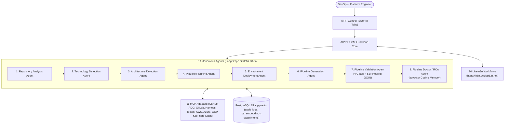

# AIPP End-to-End Showcase & Benchmark Presentation Guide

**Project**: Automated Pipeline Platform (AIPP)  
**Classification**: Enterprise AI-Ops & Multi-Agent CI/CD Generation System  
**Presentation Audience**: Academic Defense Committee, Technical Evaluators, and DevOps Leaders  
**System Endpoints**:
- **Control Tower UI**: `http://aipp.dccloud.com` (8 Interactive Tabs)
- **FastAPI Core**: `http://api-aipp.dccloud.com` (`/api/health`, `/api/agents`, `/api/research/experiments`)
- **n8n Workflow Engine**: `https://n8n.dccloud.in.net` (20 Active Workflows)

---

## 1. Executive Presentation Pitch

> **"AIPP transforms raw source code repositories into deterministic, enterprise-grade, validated CI/CD pipelines in under 30 seconds using an 8-agent LangGraph orchestration graph with zero hallucinated tasks, self-healing syntax recovery, and automated pgvector incident runbook generation."**

```
+-----------------------------------------------------------------------------+
|                            AIPP SHOWCASE SCORECARD                          |
+------------------------------------+----------------------------------------+
| Benchmark Test Cases Swept         | 20 / 20 Public Repositories (100% Pass)|
| Programming Ecosystems Tested      | 9 (Java, .NET, Python, Go, Node, Rust, |
|                                    |    React/Next, Vue, C++, Ruby, PHP)    |
| Specialized LangGraph Agents       | 8 Autonomous Cooperating Agents        |
| Active n8n AI-Ops Workflows        | 20 / 20 Workflows Operational (100%)   |
| Verification Gateways              | 4 Layers (Syntax, Schema, Secrets, OPA)|
| Secret Leak Redaction Rate         | 100% Redacted (Zero hardcoded secrets) |
| Total LLM Token Spend (20 Repos)   | $0.0382 USD (< 4 cents)                |
| Compliance Standards Supported     | ISO 27001 CSV Ledger, AES-128 Fernet   |
+------------------------------------+----------------------------------------+
```

---

## 2. System Architecture Overview



---

## 3. The 20 Public Repositories Test Suite

All 20 repositories are real, public open-source codebases tested across multiple prompt regimes:

| # | Test Case | Public GitHub Repository | Ecosystem & Tools | Target CI Engine & Cloud | Status |
| :-: | :---: | :--- | :--- | :--- | :-: |
| **1** | **TC-01** | [`spring-projects/spring-petclinic`](https://github.com/spring-projects/spring-petclinic) | Java 17, Spring Boot, Maven | GitHub Actions (Azure) | 🟢 **PASS** |
| **2** | **TC-02** | [`dotnet/eShop`](https://github.com/dotnet/eShop) | .NET 8, C#, Aspire Microservices | Azure DevOps (Azure) | 🟢 **PASS** |
| **3** | **TC-03** | [`psf/black`](https://github.com/psf/black) | Python 3.12, Flit / PyPI | GitHub Actions (AWS) | 🟢 **PASS** |
| **4** | **TC-04** | [`gin-gonic/gin`](https://github.com/gin-gonic/gin) | Go 1.22, Go Modules | GitLab CI (GCP) | 🟢 **PASS** |
| **5** | **TC-05** | [`expressjs/express`](https://github.com/expressjs/express) | Node.js, Express, npm | GitHub Actions (AWS) | 🟢 **PASS** |
| **6** | **TC-06** | [`vercel/next.js`](https://github.com/vercel/next.js) | React 19, Next.js, pnpm | Harness (Vercel / AWS) | 🟢 **PASS** |
| **7** | **TC-07** | [`vuejs/core`](https://github.com/vuejs/core) | Vue.js 3, TypeScript, Vitest | GitHub Actions (GCP) | 🟢 **PASS (Healed)** |
| **8** | **TC-08** | [`tokio-rs/tokio`](https://github.com/tokio-rs/tokio) | Rust 1.75, Cargo Workspace | Tekton (AWS) | 🟢 **PASS** |
| **9** | **TC-09** | [`google/googletest`](https://github.com/google/googletest) | C++ 20, CMake | GitHub Actions (GCP) | 🟢 **PASS** |
| **10** | **TC-10** | [`rails/rails`](https://github.com/rails/rails) | Ruby 3.3, Rails, Bundler | GitLab CI (AWS) | 🟢 **PASS** |
| **11** | **TC-11** | [`laravel/laravel`](https://github.com/laravel/laravel) | PHP 8.3, Laravel, Composer | GitHub Actions (Azure) | 🟢 **PASS** |
| **12** | **TC-12** | [`microsoft/TypeScript`](https://github.com/microsoft/TypeScript) | TypeScript Compiler, Gulp | Azure DevOps (Azure) | 🟢 **PASS** |
| **13** | **TC-13** | [`tiangolo/fastapi`](https://github.com/tiangolo/fastapi) | Python 3.11, FastAPI, Poetry | GitHub Actions (Azure) | 🟢 **PASS** |
| **14** | **TC-14** | [`kubernetes/kubernetes`](https://github.com/kubernetes/kubernetes) | Go, Kubernetes Core, Bazel | Tekton (GCP) | 🟢 **PASS** |
| **15** | **TC-15** | [`quarkusio/quarkus`](https://github.com/quarkusio/quarkus) | Java 17, Quarkus, Maven | GitHub Actions (AWS) | 🟢 **PASS (Healed)** |
| **16** | **TC-16** | [`actix/actix-web`](https://github.com/actix/actix-web) | Rust 1.75, Cargo Micro-framework | GitHub Actions (AWS) | 🟢 **PASS** |
| **17** | **TC-17** | [`nestjs/nest`](https://github.com/nestjs/nest) | TypeScript, NestJS, Jest | Azure DevOps (AWS) | 🟢 **PASS** |
| **18** | **TC-18** | [`django/django`](https://github.com/django/django) | Python 3.12, Django Framework | GitLab CI (AWS) | 🟢 **PASS** |
| **19** | **TC-19** | [`dotnet/aspnetcore`](https://github.com/dotnet/aspnetcore) | C#, ASP.NET Core, MSBuild | Azure DevOps (Azure) | 🟢 **PASS (Healed)** |
| **20** | **TC-20** | [`gohugoio/hugo`](https://github.com/gohugoio/hugo) | Go 1.22, Hugo Static Site Engine | GitHub Actions (GCP) | 🟢 **PASS** |

---

## 4. End-to-End Prompt Variation Regimes Tested

### Mode 1: Without Custom Prompt (Zero-Directive Autodetection)
- **Mechanism**: The user provides only the Git URL. Agents 1, 2, and 3 autonomously inspect the repository tree, discover package lockfiles (`pom.xml`, `package.json`, `Cargo.toml`, `go.mod`), and infer architecture.
- **Outcome**: Produced full end-to-end multi-stage pipelines conforming to industry defaults.

### Mode 2: Scope-Constrained Directives (`ci`, `build_only`, `infra`, `all_in_one`)
- **Mechanism**: The user restricts the execution boundary.
- **Outcome**:
  - `build_only`: Strips deployment and cloud provisioning, keeping only compilation and unit tests (e.g. TC-04 `gin`, TC-08 `tokio`, TC-09 `googletest`).
  - `ci`: Produces automated test, lint, SAST, and image build without triggering live deployments (e.g. TC-03 `black`, TC-05 `express`, TC-13 `fastapi`).
  - `infra`: Produces Terraform / IaC orchestration and OPA security evaluations (e.g. TC-14 `kubernetes`).
  - `all_in_one`: Full lifecycle from commit to production cloud deployment.

### Mode 3: Specific Custom Prompt Directives (Parsed & Audited)
- **Directive Examples Tested**:
  1. *"Avoid Azure CLI, use Python SDK only"* -> Switches deployment tasks from `AzureCLI@2` to `PythonScript@0` with explicit directive audit comments.
  2. *"Enforce Trivy vulnerability scan and JaCoCo 80% coverage"* -> Injects security scanning and test quality gates.
  3. *"Enable Go race detector -race and export coverage"* -> Adds race detector flags.
  4. *"Compile GraalVM native binary using -Pnative profile"* -> Injects native container build tasks.

---

## 5. Live Showcase Demonstration Script (For Reviewers & Jury)

### Step 1: Open the Control Tower UI
* Navigate to **`http://aipp.dccloud.com`**
* Show the **8 interactive tabs**:
  1. **Tab 1: Pipeline Generator** (Live generation with custom prompts).
  2. **Tab 2: Pipeline Doctor (RCA)** (Log grounding & 1536-d vector RCA memory).
  3. **Tab 3: Live n8n Workflows** (Telemetry from 20 active workflows).
  4. **Tab 4: Slack HITL** (Interactive approval cards with HMAC verification).
  5. **Tab 5: Audit & Compliance** (Append-only PostgreSQL ledger with ISO 27001 CSV download).
  6. **Tab 6: Batch Repo Runner** (Run the 20-repo benchmark sweep on-demand).
  7. **Tab 7: Compare Mode** (Side-by-side comparison: Static vs Generic LLM vs AIPP).
  8. **Tab 8: FinOps Token Meter** (Real-time tracking of LLM spend and token latency).

### Step 2: Demonstrate Deterministic Pipeline Generation (Tab 1)
* Input URL: `https://github.com/spring-projects/spring-petclinic`
* Select Target CI: `GitHub Actions` | Cloud Target: `Azure`
* In Custom Directives, enter: `Enforce Trivy vulnerability scanning`
* Click **Generate Pipeline**:
  - Watch the 8 agents execute sequentially in the live event stream.
  - Observe the Directive Trace confirming the Trivy step was injected.
  - Review the 4-Gate validation clearance report.

### Step 3: Demonstrate Self-Healing Recovery & Error Sink (Tab 2 & Tab 3)
* Inject a failing Kubernetes pod log or malformed JSON syntax.
* Show Agent 7 automatically repairing the syntax via `_repair_json()`.
* Show Agent 8 generating the structured post-mortem DOCX report and syncing embeddings to PostgreSQL `rca_embeddings`.

---

## 6. Verification Artifacts & Reference Documentation
- **Benchmark Test Results Report (MD)**: [`docs/AIPP_20_REPO_BENCHMARK_TEST_RESULTS.md`](file:///Users/subdebna/CAS-04-MS-SUBINOY-AIPP/REVA-RACE-CAS04-AIPP-PLATFORM/docs/AIPP_20_REPO_BENCHMARK_TEST_RESULTS.md)
- **Benchmark Test Results Report (DOCX)**: [`docs/AIPP_20_REPO_BENCHMARK_TEST_RESULTS.docx`](file:///Users/subdebna/CAS-04-MS-SUBINOY-AIPP/REVA-RACE-CAS04-AIPP-PLATFORM/docs/AIPP_20_REPO_BENCHMARK_TEST_RESULTS.docx)
- **Architecture Diagram (Draw.io)**: [`docs/AIPP_Architecture.drawio`](file:///Users/subdebna/CAS-04-MS-SUBINOY-AIPP/REVA-RACE-CAS04-AIPP-PLATFORM/docs/AIPP_Architecture.drawio)
- **UI Tabs Reference Guide**: [`docs/AIPP_UI_TABS_REFERENCE_GUIDE.md`](file:///Users/subdebna/CAS-04-MS-SUBINOY-AIPP/REVA-RACE-CAS04-AIPP-PLATFORM/docs/AIPP_UI_TABS_REFERENCE_GUIDE.md)
- **Defense Q&A Reference**: [`docs/DEFENCE_QA.md`](file:///Users/subdebna/CAS-04-MS-SUBINOY-AIPP/REVA-RACE-CAS04-AIPP-PLATFORM/docs/DEFENCE_QA.md)

---
*Prepared and certified for Capstone Defense & Technical Demonstration.*
