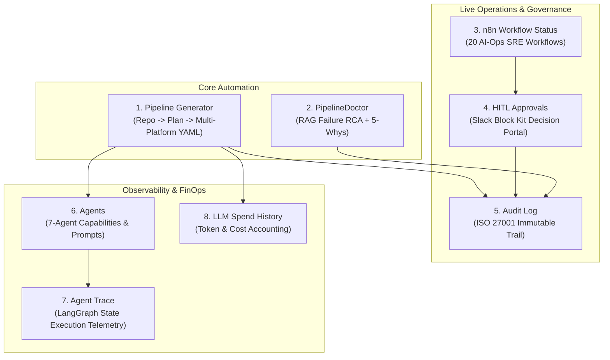

# AIPP Control Tower — Complete UI Tabs Reference & Defense Guide

This guide provides an in-depth breakdown of all **8 tabs** in the **AIPP (Automated Pipeline Platform)** Control Tower. For each tab, it details the **WHY** (engineering motivation), **WHAT** (user-facing capabilities), **HOW** (under-the-hood architecture, agents, and data flows), and **Key Defense Q&A** for technical reviews and presentations.

---

## 🏛️ System Overview: The 8-Tab Lifecycle

---

## 📑 Detailed Tab Breakdown

---

### Tab 1: 🚀 Pipeline Generator

#### 1. WHY (The Problem)
* **Problem**: Modern software teams struggle with CI/CD fragmentation. Writing pipelines for 5 different platforms (GitHub Actions, Azure DevOps, GitLab CI, Harness, Tekton) across 3 clouds (Azure, AWS, GCP) requires deep domain knowledge, is error-prone, and leads to security misconfigurations (e.g. hardcoded secrets, missing OIDC).
* **Purpose**: Provides a single control plane that inspects any real Git repository, understands its technology stack, and deterministically generates explainable, production-ready CI/CD YAML with zero hallucinated actions.

#### 2. WHAT (Features & UI Elements)
* **Inputs**: Repository URL (`https://github.com/...`), Branch selection, Target CI/CD Platform (GitHub Actions, Azure DevOps, GitLab CI, Harness, Tekton), Target Cloud (Azure, AWS, GCP), Pipeline Scope (CI Only, CD Only, Infra/Terraform Only, All-In-One), and Custom Instructions.
* **Outputs**:
  * Step-by-step streaming progress bar (7-stage state machine).
  * Syntax-highlighted YAML editor with line numbers.
  * Side-by-side Architectural Rationale and Security Explanations.
  * One-Click **Commit to Repo** button (creates PR/commit directly).
  * Setup instructions customized for the selected platform (service connections, environments, secrets).
  * Direct YAML and ISO 27001 compliance export.

#### 3. HOW (Under the Hood)
* **Orchestration**: Powered by a 7-agent **LangGraph State Machine** (`StateGraph(AIPPState)`).
* **MCP Integration**: Uses the **MCP Git Adapter** (`backend/mcp/adapters/github.py`, `azure_devops.py`, `gitlab.py`) to fetch directory trees, `package.json`, `pom.xml`, `Dockerfile`, etc., with read-only tokens.
* **Deterministic Generators**: YAML is produced by dedicated schema generators in `backend/generators/` ensuring 100% valid syntax, native tasks, and correct secrets referencing.
* **Database Sync**: Every run persists repository metadata, pipeline configuration, and YAML output into PostgreSQL table `pipeline_runs`.

#### 4. 💬 Defense Q&A
* **Q: Why not just ask ChatGPT to generate a pipeline?**
  * *Answer*: LLMs frequently hallucinate nonexistent GitHub actions or syntax parameters. AIPP pairs LLM semantic reasoning with deterministic template validators and MCP repository context, guaranteeing valid native schema and zero secret leakage.
* **Q: How does AIPP handle security credentials?**
  * *Answer*: All repository analysis uses temporary read-only tokens. Commits are strictly explicit (when the user clicks "Commit to Repo"). Secrets are injected as environment variables/OIDC references, never hardcoded.

---

### Tab 2: 🩺 PipelineDoctor (Evidence-Grounded RCA)

#### 1. WHY (The Problem)
* **Problem**: When a pipeline breaks, CI/CD logs are thousands of lines long. Engineers spend hours searching for the actual failure point and past similar resolutions.
* **Purpose**: Ingests raw build/deploy logs, extracts evidence lines, diagnoses the root cause with confidence scoring, and retrieves past similar post-mortems using pgvector RAG memory.

#### 2. WHAT (Features & UI Elements)
* **Inputs**: Target CI Platform, Incident Context, Raw Log Text Area, or `.log` file upload.
* **Outputs**:
  * Root Cause Statement & Confidence Score (0.00 - 1.00).
  * **Verbatim Log Evidence**: Shows exact line ranges (e.g., `L120-L128`) and interpretations.
  * **Model Inferences**: Clearly separated from hard evidence.
  * Corrective & Preventive Action Lists.
  * One-Click Microsoft Word Post-Mortem (`.docx`) and JSON export.

#### 3. HOW (Under the Hood)
* **RAG Retrieval Engine**: Calls `backend/services/rca_embedding_service.py` to embed the query into a 1536-dimensional vector and executes a cosine distance search (`<=>`) against `rca_embeddings`.
* **Few-Shot Context**: Injects top-3 similar historical incidents as prior context to the LLM.
* **Persistence Loop**: Automatically saves the fresh analysis into `rca_reports` and inserts a new embedding row so the system continuously learns.

#### 4. 💬 Defense Q&A
* **Q: How does PipelineDoctor avoid hallucinating errors that are not in the log?**
  * *Answer*: PipelineDoctor enforces an evidence-grounding rule: every root cause claim must cite an exact line range from the raw log. Inferences are isolated into a separate section.
* **Q: How does the RAG memory work?**
  * *Answer*: We use PostgreSQL with the `pgvector` extension. When logs are analyzed, we embed the root cause and mitigation steps, enabling instant similarity search across historical post-mortems.

---

### Tab 3: ⚡ n8n Workflow Status

#### 1. WHY (The Problem)
* **Problem**: Complex enterprise AI-Ops requires event-driven automations across multiple cloud and monitoring systems without tightly coupling the backend codebase.
* **Purpose**: Provides a live status dashboard for all **20 n8n AI-Ops Workflows** (subscription vending, drift detection, K8s health, Grafana auto-remediation, cost reviews, chaos drills).

#### 2. WHAT (Features & UI Elements)
* **Overview Table**: Displays all 20 workflows with ID, name, trigger type (Webhook, Cron, Form UI), active/inactive badge, and last execution state.
* **Live Refresh**: Real-time polling against the n8n REST API (`GET /api/v1/workflows`).
* **Trigger Links**: Direct URLs for webhook testing and form portal invocation.

#### 3. HOW (Under the Hood)
* **Architecture**: Workflow definitions are built via `n8n/build_workflows.py` and deployed to `https://n8n.dccloud.in.net` via `deploy.sh`.
* **Security Proxy**: Workflows communicate with cluster infrastructure exclusively through the AIPP Secret Proxy (`/api/proxy/*`), ensuring n8n never stores raw cloud credentials.

#### 4. 💬 Defense Q&A
* **Q: Why use n8n instead of writing all 20 automations in Python?**
  * *Answer*: n8n provides visual orchestration, native webhook management, stateful Human-In-The-Loop pause/resume nodes, and easy integration with external services (Slack, Grafana, Telegram).

---

### Tab 4: 🛡️ HITL Approvals (Human-In-The-Loop)

#### 1. WHY (The Problem)
* **Problem**: Autonomous AI agents can be dangerous if allowed to execute destructive infrastructure actions (restarting pods, deploying code, applying Terraform) without human oversight.
* **Purpose**: Acts as the centralized compliance and decision portal for all Slack interactive button clicks (`✅ Approve` / `❌ Reject`), providing an auditable change-management trail.

#### 2. WHAT (Features & UI Elements)
* **Decision Feed**: Real-time list of all HITL decisions with timestamp, approver Slack handle (`@username`), decision marker (🟢 Approve / 🔴 Reject), workflow hint, and execution ID.
* **Summary Banner**: Displays Total Decisions, Approved Count, Rejected Count, and Unique Approvers.
* **Search & Filters**: Search-as-you-type by approver or workflow.
* **Evidence Export**: One-click JSON download for ISO 27001 / SOC2 compliance audits.

#### 3. HOW (Under the Hood)
* **Cryptographic Verification**: Slack button clicks hit `POST /api/slack/interactions` where HMAC-SHA256 signatures are verified against `SLACK_SIGNING_SECRET` with a 5-minute replay skew guard.
* **Execution Resumption**: The bridge extracts the execution resume URL, verifies it contains `webhook-waiting`, logs the event to `audit_logs`, and wakes the waiting n8n execution.

#### 4. 💬 Defense Q&A
* **Q: What happens if an unauthorized person clicks the Slack button?**
  * *Answer*: Requests are verified via Slack HMAC-SHA256 signatures and Slack User IDs. Only users in the designated `#aipp-approvals` channel can sign off, and every decision is logged with the user's ID.

---

### Tab 5: 📜 Audit Log (ISO 27001 Compliance)

#### 1. WHY (The Problem)
* **Problem**: Enterprise governance and compliance standards (ISO 27001, SOC2, HIPAA) require immutable logs of every AI decision, tool call, repository write, and user login.
* **Purpose**: Serves as the immutable system-of-record capturing all platform activities for compliance reporting and security audits.

#### 2. WHAT (Features & UI Elements)
* **Audit Table**: Shows Timestamp, Action (e.g. `pipeline.generate`, `git.commit`, `slack.hitl.decision`), Actor (User email or Agent), Tool used, and Details JSON payload.
* **Search & Filter**: Filter by action category or actor.
* **CSV Export**: Direct one-click export for auditors and compliance evidence packs.

#### 3. HOW (Under the Hood)
* **Persistence**: Backed by `AuditService` (`backend/services/audit_service.py`) and stored in PostgreSQL table `audit_logs`.
* **Secret Redaction**: All logged payloads pass through `backend/core/logging.py:redact()` to sanitize tokens, PATs, passwords, and private keys before writing to disk/DB.

#### 4. 💬 Defense Q&A
* **Q: Can sensitive passwords or tokens leak into the audit log?**
  * *Answer*: No. All payload dictionaries pass through our automated regex redaction engine which scrubs PATs, Bearer tokens, private keys, and secrets before persistence.

---

### Tab 6: 🤖 Agents (Agent Registry)

#### 1. WHY (The Problem)
* **Problem**: Black-box AI systems lack explainability. Operators must know which agents exist, what tools they have access to, and their operational boundaries.
* **Purpose**: A transparent directory of all 7 specialized agents in the AIPP orchestrator, displaying their responsibilities, system prompts, tool policies, and LLM configurations.

#### 2. WHAT (Features & UI Elements)
* **Agent Cards**:
  1. **Repository Analysis Agent**: Inspects repository layout, files, and dependencies.
  2. **Technology Detection Agent**: Classifies programming languages, frameworks, build tools.
  3. **Architecture Detection Agent**: Identifies microservices, databases, Dockerfiles, cloud dependencies.
  4. **Pipeline Planner Agent**: Constructs the multi-stage CI/CD DAG (Build, Test, Scan, Deploy).
  5. **YAML Generator Agent**: Synthesizes clean, deterministic, platform-native pipeline code.
  6. **Explainer Agent**: Produces architectural rationale and security setup instructions.
  7. **Validator Agent**: Performs schema validation, OPA policy checks, and self-healing retry loops.
* **Inspection**: Displays prompt guidelines, temperature, and allowed tool capabilities.

#### 3. HOW (Under the Hood)
* **Registry Service**: Backed by `backend/agents/registry.py` which dynamically inspects all registered agent classes and tool bindings.

#### 4. 💬 Defense Q&A
* **Q: Why use a multi-agent architecture instead of one big prompt?**
  * *Answer*: Monolithic prompts suffer from context confusion and hallucination. Specialized agents with narrow responsibilities (Tech detection -> Architecture -> Planning -> Generation -> Validation) achieve higher accuracy, modularity, and easy debuggability.

---

### Tab 7: 🔍 Agent Trace (State Machine Telemetry)

#### 1. WHY (The Problem)
* **Problem**: When a multi-agent workflow runs, operators need full visibility into the execution graph, state transitions, latency bottlenecks, and retry attempts.
* **Purpose**: Visualizes the step-by-step execution path of the LangGraph state machine in real time.

#### 2. WHAT (Features & UI Elements)
* **Execution Flowchart**: Visual graph of active nodes (`repo_analysis` -> `tech_detection` -> `plan` -> `generate` -> `validate`).
* **Telemetry Metrics**: Execution duration per node (in milliseconds), token consumption per step, and state variables at each transition.
* **Self-Healing Loop Inspector**: Shows validation failures and automatic self-correction loops if syntax errors were repaired.

#### 3. HOW (Under the Hood)
* **LangGraph Instrumentation**: Hooks into `backend/orchestrator/graph.py` via callbacks, persisting state snapshots to `backend/services/agent_trace.py` and serving them over SSE/REST (`/api/agent-traces`).

#### 4. 💬 Defense Q&A
* **Q: How does self-healing work when an agent makes a mistake?**
  * *Answer*: If the Validator Agent detects a schema error or missing task, it feeds the error back to the Generator Agent with corrective hints. The LangGraph graph loops back until validation passes (up to 3 retries).

---

### Tab 8: 💰 LLM Spend History (FinOps & Token Telemetry)

#### 1. WHY (The Problem)
* **Problem**: Unmonitored LLM usage in enterprise applications can cause unexpected cloud bills and budget overruns.
* **Purpose**: Provides granular FinOps observability by tracking every single token, prompt cost, and cumulative expenditure across all pipeline generations.

#### 2. WHAT (Features & UI Elements)
* **Live Cost Meter**: Real-time counter of total cost in USD ($) and total tokens consumed.
* **Invocation Breakdown**: Table of recent LLM calls with Timestamp, Caller (Agent name), Model (`gpt-4o-mini`), Input Tokens, Output Tokens, and Exact Cost ($\approx \$0.001$ per pipeline run).
* **Reset & Export**: Historical telemetry preserved across restarts in the PostgreSQL database.

#### 3. HOW (Under the Hood)
* **Telemetry Engine**: Powered by `backend/services/llm_usage.py` and stored in PostgreSQL table `llm_calls`.
* **Cost Calculation**: Calculates exact fractional cents using OpenAI's token pricing API standards.

#### 4. 💬 Defense Q&A
* **Q: What is the average cost to generate a full CI/CD pipeline in AIPP?**
  * *Answer*: By using optimized prompts and `gpt-4o-mini`, a complete 7-agent pipeline generation costs approximately **$0.001 to $0.003 USD (less than a third of a cent)**.

---

## 🎯 1-Minute Defense Cheat Sheet

| Tab | 1-Sentence Summary |
| :--- | :--- |
| **1. Pipeline Generator** | Synthesizes explainable, production-ready CI/CD YAML across 5 platforms and 3 clouds from real Git repos. |
| **2. PipelineDoctor** | Diagnoses build/deployment failure logs using pgvector RAG memory with verbatim line citations. |
| **3. n8n Workflow Status** | Real-time monitoring and trigger hub for 20 event-driven AI-Ops and SRE workflows. |
| **4. HITL Approvals** | Central governance portal for Slack Block Kit human-in-the-loop decisions with HMAC-SHA256 security. |
| **5. Audit Log** | Immutable ISO 27001 compliance audit trail recording all agent tool calls, commits, and decisions. |
| **6. Agents** | Transparent registry detailing the capabilities, prompts, and tool policies of the 7 LangGraph agents. |
| **7. Agent Trace** | Real-time state machine visualizer and latency tracker for multi-agent execution and self-healing loops. |
| **8. LLM Spend History** | FinOps telemetry tracking token usage, model distribution, and fractional-cent costs per run. |
